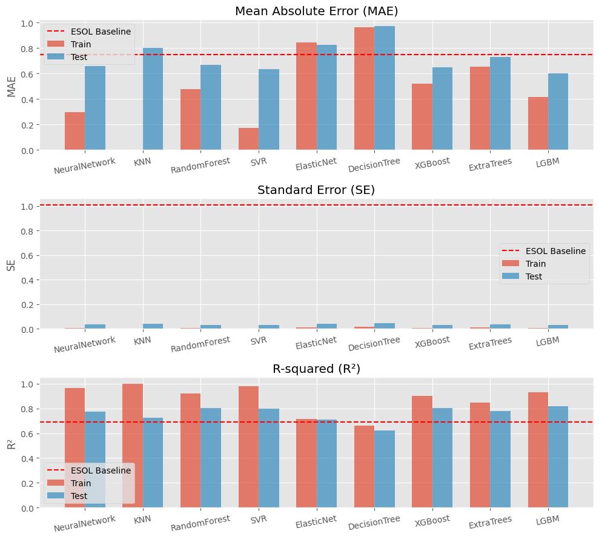

# Laporan Proyek Machine Learning - Jauhar Mumtaz

## Domain Proyek  

Kelarutan molekul organik dalam air adalah salah satu sifat fisik kunci dalam dunia medis. Sifat ini memiliki hubungan langsung dengan absorpsi, yang merupakan parameter utama distribusi senyawa aktif biologis dalam makhluk hidup dan lingkungan. Oleh karena itu, kelarutan sangat memengaruhi bioavailabilitas, efektivitas, dan nilai jual senyawa aktif.  

Pengukuran kelarutan dalam air dengan tingkat akurasi tinggi membutuhkan biaya yang tidak sedikit, mencakup waktu, instrumen, keahlian penguji, serta keterbatasan sampel fisik. Beberapa metode untuk menghitung kelarutan dalam air (*S*) telah dikembangkan, salah satunya adalah *General Solubility Equation (GSE)* yang diperkenalkan oleh [Sanghvi T. *et al.*, 2003](https://pubs.acs.org/doi/10.1021/acs.molpharmaceut.4c00685). Metode ini memperkirakan kelarutan dalam air (*S*) sebagai fungsi dari titik lebur (*T*) dan koefisien partisi oktanol-air (*K*):  

$$log(S) = -0.01 (T - 25°C) - log(K) + 0.50$$

Nilai partisi oktanol (*P*) dapat ditentukan berdasarkan struktur senyawa, tetapi penentuan titik lebur (*T*) tetap membutuhkan pengukuran laboratorium. Metode GSE sangat berguna jika data titik lebur tersedia, namun untuk senyawa yang hanya diketahui strukturnya, diperlukan metode estimasi yang memanfaatkan struktur molekul secara langsung.  

Metode lain yang telah dikembangkan adalah *Estimated Solubility (ESOL)*, model *machine learning* yang dikembangkan oleh [Delaney JS, 2003](https://pubs.acs.org/doi/abs/10.1021/ci034243x). ESOL menggunakan delapan parameter deskriptor molekul seperti *clogP*, berat molekul (*molecular weight, molWT*), jumlah ikatan rotasi (*rotatable bond, rb*), proporsi aromatik (*aromatic proportion, ap*), proporsi non-karbon, donor dan akseptor ikatan hidrogen (*hbd, hba*), serta luas permukaan polar (*polar surface area, psa*). Berdasarkan 2874 data pelatihan, ESOL memberikan estimasi yang lebih *robust* dibandingkan GSE, dengan hasil sebagai berikut:  

| Metode  | *R*² | SE   | MAE  |  
|---------|------|------|------|  
| ESOL    | 0.69 | 1.01 | 0.75 |  
| GSE     | 0.67 | 1.05 | 0.81 |  

Hasil dari ESOL juga menunjukkan bahwa parameter paling signifikan adalah *clogP*, diikuti oleh berat molekul (*molWT*), proporsi aromatik (*ap*), dan jumlah ikatan rotasi (*rb*).  

Dengan perkembangan teknologi, model *machine learning* terus berkembang, baik dari segi ukuran basis data, *hyperparameter tuning*, maupun struktur model. Penelitian ini bertujuan untuk mengembangkan metode estimasi kelarutan molekul dalam air menggunakan dataset yang lebih besar. Dalam penelitian ini, hanya variabel *SMILES* dan *log S* yang digunakan sebagai input utama. Dataset [SMILES-enumeration-datasets](https://github.com/summer-cola/smiles-enumeration-datasets) menyediakan data *SMILES* dengan berbagai deskriptor molekul, mulai dari deskriptor 0D, 1D, 2D, hingga 3D, yang menghasilkan total 31 parameter untuk digunakan sebagai input ke berbagai model.  

Penelitian ini mengimplementasikan berbagai model regresi berbasis *machine learning* dan *deep learning*, seperti Neural Network (*NN*), K-Nearest Neighbors (*KNN*), Random Forest (*RF*), Support Vector Regressor (*SVR*), Elastic Net (*EN*), Decision Tree (*DT*), Extreme Gradient Boosting (*XGBoost*), Extra Trees (*ET*), dan Light Gradient-Boosting Machine (*LightGBM*). Model terbaik akan dipilih berdasarkan nilai Mean Absolute Error (*MAE*), Standard Error (*SE*), dan Koefisien Determinasi (*R²*), serta dilakukan interpretasi model menggunakan SHapley Additive exPlanations (*SHAP*) untuk mengidentifikasi parameter paling signifikan.  

## Business Understanding  

### Problem Statements  

1. Prediksi kelarutan dalam air (*logS*) suatu molekul *drug-like* merupakan langkah penting dalam dunia *drug discovery* karena memengaruhi efisiensi dan proses pengembangan obat. Apakah prediksi *logS* dapat dilakukan menggunakan model *machine learning* atau *deep learning* sederhana dengan fitur yang diekstrak hanya dari anotasi *SMILES* suatu molekul?  
2. Di antara berbagai model *machine learning* dan *deep learning* sederhana, model manakah yang memiliki nilai Mean Absolute Error (*MAE*) dan Standard Error (*SE*) paling rendah, serta nilai Koefisien Determinasi (*R²*) yang tinggi dalam memprediksi *logS* berdasarkan fitur yang digunakan?  
3. Dari delapan fitur yang digunakan dalam publikasi [ESOL](https://pubs.acs.org/doi/abs/10.1021/ci034243x#), yaitu *clogP*, berat molekul (*molWT*), jumlah ikatan rotasi (*rb*), proporsi aromatik (*ap*), donor dan akseptor ikatan hidrogen (*hbd, hba*), serta luas permukaan polar (*psa*), fitur mana yang paling berpengaruh terhadap nilai *logS*? Adakah fitur lain yang memberikan kontribusi signifikan?  

### Goals  

1. Mengidentifikasi apakah prediksi *logS* hanya dari fitur hasil ekstraksi *SMILES* dapat dilakukan menggunakan model *machine learning* atau *deep learning* sederhana.  
2. Menentukan model *machine learning* atau *deep learning* sederhana dengan performa terbaik berdasarkan metrik *MAE*, *SE*, dan *R²*.  
3. Mengidentifikasi fitur yang paling berpengaruh terhadap nilai *logS* (kelarutan molekul dalam air).  

### Solution Statements  

1. Melakukan prediksi *logS* menggunakan fitur hasil ekstraksi dari anotasi *SMILES* molekul melalui model *machine learning* atau *deep learning*.  
2. Menguji dan mengevaluasi berbagai model dengan *hyperparameter* yang telah ditetapkan sebelumnya, dan memilih model terbaik berdasarkan metrik *MAE*, *SE*, dan *R²*.  
3. Mengekstraksi bobot fitur menggunakan teknik interpretasi model seperti SHapley Additive exPlanations (*SHAP*) untuk mengidentifikasi parameter yang paling signifikan.  

## Data Understanding  

Dataset yang digunakan untuk memprediksi nilai *logS* suatu molekul diambil dari dataset GitHub yang dipublikasikan oleh `summer-cola` dengan nama repository **`SMILES-enumeration-datasets`**. Dataset ini dapat diakses melalui tautan [berikut](https://github.com/summer-cola/smiles-enumeration-datasets) dan mencakup berbagai sifat fisik molekul, seperti *logD*, *logP*, dan *logS*. Dataset yang digunakan untuk prediksi *logS* terletak di direktori `logS` dengan nama file `traintest.csv`, yang berisi 7954 baris data.  

### Informasi Variabel  

Dataset ini memiliki delapan variabel utama dengan deskripsi sebagai berikut:  

| **Variabel**   | **Deskripsi**                                                                                         | **Contoh Nilai**         |  
|-----------------|-----------------------------------------------------------------------------------------------------|--------------------------|  
| `Unnamed: 0`    | Indeks otomatis yang dihasilkan saat data diimpor.                                                  | 0                        |  
| `Compound ID`   | ID unik untuk mengidentifikasi setiap senyawa dalam dataset.                                        | C4659                    |  
| `InChIKey`      | Kode alfanumerik pendek dari *International Chemical Identifier* (InChI) untuk identifikasi global. | WIKXJKUZYYOTBP-UHFFFAOYSA-N |  
| `SMILES`        | *Simplified Molecular Input Line Entry System*, notasi struktur molekul berbasis *ASCII strings*.   | CCCCC(COC(=O)N)(COC(=O)NC(C)C)C |  
| `logS`          | Nilai logaritmik kelarutan dalam air (S), yang mengindikasikan tingkat kelarutan molekul dalam air.  | -3.633501683             |  
| `logP`          | Nilai logaritmik koefisien partisi oktanol-air (*P*), mengukur lipofilisitas molekul.               | 3.504                    |  
| `MW`            | Berat molekul (*Molecular Weight*), yaitu total massa atom molekul (dalam satuan Dalton/Da).        | 274.357                  |  
| `smi`           | Representasi alternatif untuk *SMILES*.                                                            | C C C C C ( C O C ( = O ) N ) ... |  

Dataset ini menggunakan deskriptor molekul berbasis struktur (*SMILES*) untuk menghasilkan total 31 variabel tambahan melalui kalkulasi deskriptor 0D, 1D, 2D, dan 3D, yang digunakan sebagai *input* ke model.  

### Variabel Deskriptor  

| **Variabel**           | **Deskripsi**                                                                                  | **Contoh Nilai**     |  
|------------------------|-----------------------------------------------------------------------------------------------|----------------------|  
| `logS`                 | Nilai logaritmik kelarutan molekul (terutama obat) dalam air.                                  | -2.74                |  
| `molWt`                | Berat molekul (*Molecular Weight*).                                                           | 170.92               |  
| `numAtoms`             | Jumlah atom berat (selain hidrogen) dalam molekul.                                             | 8                    |  
| `molMR`                | *Molecular refractivity*, kemampuan molekul untuk membiaskan cahaya, terkait polarizabilitas. | 21.6                 |  
| `rings`                | Jumlah cincin dalam struktur molekul.                                                         | 0                    |  
| `aromatic`             | Jumlah cincin dengan sifat aromatik dalam molekul.                                             | 0                    |  
| `ap`                   | Proporsi aromatik, rasio atom aromatik terhadap total atom.                                    | 0.0                  |  
| `chiralC`              | Jumlah pusat kiral (Karbon) dalam molekul.                                                    | 0                    |  
| `logP`                 | Koefisien partisi logaritmik, mengukur kepolaran molekul.                                      | 2.6496               |  
| `hbd`                  | Jumlah donor ikatan hidrogen (*Hydrogen Bond Donor*).                                          | 0                    |  
| `hba`                  | Jumlah akseptor ikatan hidrogen (*Hydrogen Bond Acceptor*).                                    | 0                    |  
| `rb`                   | Jumlah ikatan yang dapat berputar (*Rotatable Bond*).                                          | 1                    |  
| `tpsa`                 | *Topological Polar Surface Area*, luas permukaan polar molekul.                               | 0.0                  |  
| `nh2`                  | Jumlah gugus amina dalam molekul.                                                             | 0                    |  
| `oh`                   | Jumlah gugus hidroksil dalam molekul.                                                         | 0                    |  
| `balabanJ`             | Indeks Balaban, ukuran kekompakan topologi molekul.                                            | 4.020392             |  
| `bertzCT`              | Kompleksitas topologi Bertz, mengukur kerumitan struktur molekul berdasarkan graf.             | 67.01955             |  
| `hallKierAlpha`        | Indeks Hall-Kier Alpha, terkait bentuk molekul dan polarizabilitasnya.                         | 0.3                  |  
| `ipc`                  | Indeks polaritas informasi (*Information Content Index*), mengukur keragaman struktur molekul. | 21.306059            |  
| `chi0`                 | Indeks jalur Chi 0, mengukur topologi molekul berdasarkan jumlah dan jenis atom.               | 7.0                  |  
| `chi1`                 | Indeks jalur Chi 1, mengukur pola ikatan atom dalam molekul.                                   | 3.25                 |  
| `kappa1`               | Indeks kappa molekuler 1, mengukur fleksibilitas molekul.                                      | 8.3                  |  
| `kappa2`               | Indeks kappa molekuler 2, variasi lain untuk mengukur fleksibilitas molekul.                  | 1.91511              |  
| `kappa3`               | Indeks kappa molekuler 3, variasi lebih lanjut dari pengukuran fleksibilitas molekul.          | 2.046098             |  
| `fractionCSP3`         | Fraksi atom karbon dengan hibridisasi sp³.                                                    | 1.0                  |  
| `asphericity`          | Asferisitas, pengukuran penyimpangan bentuk molekul dari bola sempurna.                        | 0.072556             |  
| `eccentricity`         | Eksentrisitas, mengukur asimetri distribusi atom dalam molekul.                                | 0.785158             |  
| `inertialShapeFactor`  | Faktor bentuk inersia, menunjukkan bentuk molekul berdasarkan distribusi massa atom.           | 0.003042             |  
| `radiusOfGyration`     | Jari-jari perputaran, mengukur penyebaran atom dalam molekul relatif terhadap pusat massa.      | 1.836359             |  
| `spherocityIndex`      | Indeks sferisitas, menunjukkan seberapa dekat bentuk molekul dengan bola.                      | 0.711911             |  
| `ncp`                  | Proporsi non-karbon terhadap total atom dalam molekul.                                         | 0.75                 |  
| `ecfp`                 | Extended Circular Fingerprints, representasi molekul berbasis bit.                            | [0, 0, 1, ...]       |  

Berikut merupakan keterangan tipe data pada dataset.

### Data Type Information  

| **Tipe Data** | **Variabel**                                                                                      | **Keterangan**                                         |  
|---------------|--------------------------------------------------------------------------------------------------|-------------------------------------------------------|  
| **Float**     | `logS`, `molWt`, `molMR`, `ap`, `logP`, `tpsa`, `balabanJ`, `bertzCT`, `hallKierAlpha`, `ipc`, `chi0`, `chi1`, `kappa1`, `kappa2`, `kappa3`, `fractionCSP3`, `asphericity`, `eccentricity`, `inertialShapeFactor`, `radiusOfGyration`, `spherocityIndex`, `ncp`.   | Data hasil kalkulasi matematis dan fraksi.           |
| **Integer**   | `numAtoms`, `rings`, `aromatic`, `chiralC`, `hbd`, `hba`, `rb`, `nh2`, `oh`.                      | Data penjumlahan satuan bilangan bulat.              |  
| **List**      | `ecfp`.                                                                                          | Data berisi 2048 bit interpretasi molekul (0 dan 1). |  

## Data Cleaning

### Handling Duplicate Data  

Setelah dilakukan pengecekan, dataset tidak memiliki data kosong (*Null* atau *NaN*) yang perlu diimputasi. Namun, ditemukan 1 baris data duplikat. Data duplikat ini dihapus untuk memastikan integritas dataset.  

### Statistical Description  

Berikut adalah deskripsi statistik dari data sebelum dilakukan proses pembersihan:  

<table border="1" class="dataframe">
  <thead>
    <tr style="text-align: right;">
      <th></th>
      <th>logS</th>
      <th>molWt</th>
      <th>numAtoms</th>
      <th>molMR</th>
      <th>rings</th>
      <th>aromatic</th>
      <th>ap</th>
      <th>chiralC</th>
      <th>logP</th>
      <th>hbd</th>
      <th>...</th>
      <th>kappa1</th>
      <th>kappa2</th>
      <th>kappa3</th>
      <th>fractionCSP3</th>
      <th>asphericity</th>
      <th>eccentricity</th>
      <th>inertialShapeFactor</th>
      <th>radiusOfGyration</th>
      <th>spherocityIndex</th>
      <th>ncp</th>
    </tr>
  </thead>
  <tbody>
    <tr>
      <th>count</th>
      <td>7954.000000</td>
      <td>7954.000000</td>
      <td>7954.000000</td>
      <td>7954.000000</td>
      <td>7954.000000</td>
      <td>7954.000000</td>
      <td>7954.000000</td>
      <td>7954.00000</td>
      <td>7954.000000</td>
      <td>7954.000000</td>
      <td>...</td>
      <td>7954.000000</td>
      <td>7954.000000</td>
      <td>7954.000000</td>
      <td>7954.000000</td>
      <td>7954.000000</td>
      <td>7954.000000</td>
      <td>7954.000000</td>
      <td>7.954000e+03</td>
      <td>7954.000000</td>
      <td>7954.000000</td>
    </tr>
    <tr>
      <th>mean</th>
      <td>-2.981528</td>
      <td>292.151987</td>
      <td>19.181795</td>
      <td>75.840784</td>
      <td>1.975107</td>
      <td>1.195248</td>
      <td>0.352023</td>
      <td>0.97297</td>
      <td>1.912550</td>
      <td>1.239125</td>
      <td>...</td>
      <td>3.924647</td>
      <td>6.902837</td>
      <td>5.105968</td>
      <td>0.459514</td>
      <td>0.392271</td>
      <td>0.937606</td>
      <td>0.002492</td>
      <td>3.618187e+00</td>
      <td>0.250457</td>
      <td>0.270458</td>
    </tr>
    <tr>
      <th>std</th>
      <td>2.200720</td>
      <td>138.909559</td>
      <td>9.048712</td>
      <td>34.724211</td>
      <td>1.461655</td>
      <td>0.982673</td>
      <td>0.260995</td>
      <td>2.21534</td>
      <td>2.510816</td>
      <td>1.513059</td>
      <td>...</td>
      <td>2.528799</td>
      <td>4.207856</td>
      <td>22.793668</td>
      <td>0.301113</td>
      <td>0.193149</td>
      <td>0.065069</td>
      <td>0.010385</td>
      <td>1.462360e+00</td>
      <td>0.161920</td>
      <td>0.133211</td>
    </tr>
    <tr>
      <th>min</th>
      <td>-16.259392</td>
      <td>16.043000</td>
      <td>1.000000</td>
      <td>0.000000</td>
      <td>0.000000</td>
      <td>0.000000</td>
      <td>0.000000</td>
      <td>0.00000</td>
      <td>-46.668600</td>
      <td>0.000000</td>
      <td>...</td>
      <td>0.000000</td>
      <td>0.000000</td>
      <td>-27.040000</td>
      <td>0.000000</td>
      <td>0.000000</td>
      <td>0.000000</td>
      <td>0.000000</td>
      <td>3.469447e-18</td>
      <td>0.000000</td>
      <td>0.000000</td>
    </tr>
    <tr>
      <th>25%</th>
      <td>-4.259388</td>
      <td>197.190000</td>
      <td>13.000000</td>
      <td>51.231650</td>
      <td>1.000000</td>
      <td>0.000000</td>
      <td>0.000000</td>
      <td>0.00000</td>
      <td>0.779440</td>
      <td>0.000000</td>
      <td>...</td>
      <td>2.475306</td>
      <td>4.088493</td>
      <td>2.171001</td>
      <td>0.235294</td>
      <td>0.239931</td>
      <td>0.913155</td>
      <td>0.000463</td>
      <td>2.823452e+00</td>
      <td>0.131913</td>
      <td>0.181818</td>
    </tr>
    <tr>
      <th>50%</th>
      <td>-2.824600</td>
      <td>273.798500</td>
      <td>18.000000</td>
      <td>72.044850</td>
      <td>2.000000</td>
      <td>1.000000</td>
      <td>0.375000</td>
      <td>0.00000</td>
      <td>2.045950</td>
      <td>1.000000</td>
      <td>...</td>
      <td>3.534830</td>
      <td>6.038287</td>
      <td>3.400000</td>
      <td>0.428571</td>
      <td>0.374412</td>
      <td>0.957519</td>
      <td>0.001016</td>
      <td>3.473871e+00</td>
      <td>0.230156</td>
      <td>0.250000</td>
    </tr>
    <tr>
      <th>75%</th>
      <td>-1.489481</td>
      <td>359.713500</td>
      <td>23.000000</td>
      <td>93.985125</td>
      <td>3.000000</td>
      <td>2.000000</td>
      <td>0.545455</td>
      <td>1.00000</td>
      <td>3.401700</td>
      <td>2.000000</td>
      <td>...</td>
      <td>4.818714</td>
      <td>8.679717</td>
      <td>5.344128</td>
      <td>0.666667</td>
      <td>0.532319</td>
      <td>0.981270</td>
      <td>0.002296</td>
      <td>4.223524e+00</td>
      <td>0.347257</td>
      <td>0.333333</td>
    </tr>
    <tr>
      <th>max</th>
      <td>1.580000</td>
      <td>1583.582000</td>
      <td>109.000000</td>
      <td>370.217200</td>
      <td>16.000000</td>
      <td>12.000000</td>
      <td>1.000000</td>
      <td>27.00000</td>
      <td>20.854600</td>
      <td>19.000000</td>
      <td>...</td>
      <td>72.265273</td>
      <td>62.805231</td>
      <td>1128.960000</td>
      <td>1.000000</td>
      <td>1.000000</td>
      <td>1.000000</td>
      <td>0.339204</td>
      <td>5.985842e+01</td>
      <td>0.999963</td>
      <td>1.000000</td>
    </tr>
  </tbody>
</table>

8 rows × 31 columns

### Handling Outliers  

  
  Box plot outlier pada variabel yang digunakan <b>ESOL</b>.

Sebaran outlier diperiksa pada delapan variabel utama dari publikasi ESOL, yaitu `logP`, `molWt`, `rb`, `ap`, `ncp`, `hbd`, `hba`, dan `tpsa`. Berdasarkan analisis *box plot*, beberapa variabel memiliki nilai outlier:  

| **Variabel** | **Sebaran Data**                          | **Rentang**                         |  
|--------------|-------------------------------------------|-------------------------------------|  
| `logP`       | Terpusat pada rentang `0.8 - 3.5`         | `-46.6 - 20.8`                     |  
| `molWt`      | Terpusat pada rentang `197.1 - 359.7`     | `16 - 1583.5`                      |  
| `rb`         | Terpusat pada rentang `3 - 9`             | `0 - 59`                           |  
| `ap`         | Terpusat pada rentang `0 - 0.5`           | `0 - 1`                            |  
| `ncp`        | Terpusat pada rentang `0.1 - 0.3`         | `0 - 1`                            |  
| `hbd`        | Terpusat pada rentang `0 - 2`             | `0 - 19`                           |  
| `hba`        | Terpusat pada rentang `2 - 4`             | `0 - 35`                           |  
| `tpsa`       | Terpusat pada rentang `25.3 - 71.4`       | `25.3 - 601.8`                     |  

**Interpretasi**:  
- Nilai outlier dianggap relevan karena mereka mencerminkan sifat fisika molekul berdasarkan struktur.  
- Tidak ada penghapusan outlier dilakukan untuk menghindari hilangnya informasi signifikan dalam dataset.  

### Univariate Analysis  

  
    

  

**Label Variable (`logS`)**  
Distribusi label `logS` menunjukkan persebaran utama di rentang `-7 - 0.1`, yang berisi lebih dari 100 data. Persebaran ini mencakup kategori dari *poorly soluble* hingga *highly soluble* berdasarkan skala [SwissADME](https://www.nature.com/articles/srep42717):

$$insoluble \lt −10 \lt poorly \lt −6 \lt moderately \lt −4 \lt soluble \lt −2 \lt very \lt 0 \lt highly$$

   

  
  <small>Plot histogram variabel <b>logS</b> sebagai label.</small>  

  

**Input Features**  
Sebagian besar fitur input menunjukkan distribusi yang skewed (*miring*). Fitur seperti `rings`, `hbd`, `hba`, `rb`, dan `chi0` menunjukkan kluster yang berbeda, yang mengindikasikan adanya kelompok tertentu dalam data.  

#### Pemahaman Fitur Spesifik:  
1. **Sifat Molekuler**:  
   - Fitur seperti `molWt`, `numAtoms`, dan `molMR` menunjukkan korelasi positif. Molekul yang lebih besar cenderung memiliki nilai yang lebih tinggi pada fitur-fitur ini.  

2. **Ikatan Hidrogen**:  
   - `hbd` (jumlah donor ikatan hidrogen) dan `hba` (jumlah akseptor ikatan hidrogen) menunjukkan korelasi negatif. Molekul dengan lebih banyak donor ikatan hidrogen cenderung memiliki lebih sedikit akseptor.  

3. **Struktur Cincin**:  
   - `rings` dan `aromatic` menunjukkan hubungan erat. Semua cincin aromatik termasuk dalam kategori cincin (`rings`), tetapi tidak semua cincin bersifat aromatik.  

4. **Deskripsi Bentuk**:  
   - Fitur seperti `asphericity`, `eccentricity`, dan `spherocityIndex` memberikan wawasan tentang bentuk dan distribusi molekul, dengan molekul lebih kompleks menunjukkan nilai lebih tinggi untuk fitur-fitur ini.  

### Multivariate - Numerical Features  

Untuk memahami hubungan antar fitur numerik, dilakukan analisis korelasi dengan matriks korelasi. Berikut adalah hasilnya:  

  
    

  

  
  <small>Plot matriks korelasi antar variabel.</small>  

  

#### Korelasi Positif Kuat dengan `logS`:  
- Molekul yang lebih besar (`molWt`, `numAtoms`, dan `molMR`) cenderung memiliki kelarutan lebih rendah (`logS` lebih kecil).  
- Molekul dengan lebih banyak cincin atau struktur aromatik cenderung memiliki kelarutan lebih rendah, kemungkinan akibat stabilisasi resonansi atau efek pasangan elektron bebas (*PEB*).  

#### Korelasi Positif Sedang dengan `logS`:  
- Molekul yang lebih lipofilik (`logP` lebih tinggi) cenderung memiliki kelarutan lebih rendah.  
- Molekul dengan luas permukaan polar lebih besar (`tpsa`) juga cenderung memiliki kelarutan lebih rendah.  

#### Korelasi Lemah atau Tidak Signifikan dengan `logS`:  
- Banyak deskriptor molekuler lainnya memiliki korelasi lemah atau tidak signifikan dengan `logS`. Ini menunjukkan bahwa fitur-fitur ini memiliki pengaruh minimal dalam prediksi kelarutan.  

#### Korelasi Tinggi antar Deskriptor:  
- Fitur seperti `molWt`, `numAtoms`, `bertzCT`, `balabanJ`, `chi0`, dan `chi1` menunjukkan korelasi positif tinggi satu sama lain. Hal ini menunjukkan bahwa fitur-fitur ini memberikan informasi yang mirip atau saling terkait dalam deskripsi struktur molekul.  

## Data Preparation  

### Unpack List Feature  

Fitur `ecfp` pada dataset berisi representasi molekuler berupa daftar *binary fingerprints* dengan panjang 2048 bit. Setiap elemen memiliki nilai `1` (True) atau `0` (False). Untuk mempermudah pemrosesan oleh model, fitur ini di-*unpack* menjadi 2048 kolom terpisah. Hasilnya, setiap kolom merepresentasikan satu elemen dari *fingerprint*, sehingga dapat digunakan sebagai variabel numerik individual oleh algoritma *machine learning*.  

### Pembagian Data: Train dan Test  

Dataset dibagi menjadi dua subset, yaitu:  
1. **Train**: Digunakan untuk melatih model.  
2. **Test**: Digunakan untuk memvalidasi model dan mengevaluasi performa.  

Proporsi pembagian adalah `90:10`, menghasilkan bentuk data sebagai berikut:  

| **Kategori**   | **Shape**           |  
|----------------|---------------------|  
| Data Train     | (`7157`, `2078`)    |  
| Label Train    | (`7157`,)           |  
| Data Test      | (`796`, `2078`)     |  
| Label Test     | (`796`,)            |  

### Scaling dan Normalisasi  

Pada tahap ini, fitur numerik bertipe `float` distandarisasi atau dinormalisasi untuk meningkatkan konsistensi skala antar fitur. Sementara itu, fitur dengan tipe `int` tidak diubah untuk menghindari kehilangan informasi penting dari data diskret.  

Berbagai teknik scaling dan normalisasi diuji, dengan metrik evaluasi *Negative Mean Squared Error (Negative MSE)*. Teknik terbaik adalah **Quantile Transformer** dengan distribusi **Uniform**, memberikan nilai evaluasi terbaik sebesar **`-1.4793369599164947`**.  

Berikut adalah tabel algoritma yang diuji beserta penjelasan efeknya pada data:  

| **Algoritma**               | **Deskripsi**                                                                                  | **Efek pada Data**                                      |  
|-----------------------------|-----------------------------------------------------------------------------------------------|-------------------------------------------------------|  
| **Standard Scaler**         | Skala data agar memiliki rata-rata 0 dan standar deviasi 1.                                   | Menyelaraskan data (mean = 0, std = 1).               |  
| **Min-Max Scaler**          | Mengubah skala data ke rentang tertentu (default 0 hingga 1).                                 | Menggeser data agar berada dalam rentang [0, 1].      |  
| **Robust Scaler**           | Menggunakan median dan IQR untuk mengurangi pengaruh outlier.                                 | Mengurangi dampak outlier.                            |  
| **Quantile Transformer**    | Mengubah data agar mengikuti distribusi tertentu (Normal/Uniform).                           | Membuat distribusi lebih seragam atau normal.         |  
| **Power Transformer**       | Menerapkan transformasi daya (Yeo-Johnson) untuk menstabilkan variansi.                       | Mengurangi *skewness* untuk mendekati distribusi Gaussian. |  

---

### Formula Matematis  

Berikut adalah formula matematis dari setiap algoritma yang digunakan:  

1. **Standard Scaler**  

$$z_i = \frac{x_i - \mu}{\sigma}$$
   - $`x_i`$ : Nilai asli data.  
   - $`z_i`$ : Nilai data setelah diskalakan.  
   - $`\mu`$ : Rata-rata dari seluruh data.  
   - $`\sigma`$ : Deviasi standar dari seluruh data.  

2. **Min-Max Scaler**

$$z_i = \frac{x_i - \min(x)}{\max(x) - \min(x)}$$
   - $`x_i`$ : Nilai asli data.  
   - $`\min(x)`$ : Nilai minimum dalam dataset.  
   - $`\max(x)`$ : Nilai maksimum dalam dataset.  

3. **Robust Scaler** 

$$z_i = \frac{x_i - Q_2}{Q_3 - Q_1}$$
   - $`Q_2`$ : Median atau kuartil kedua.  
   - $`Q_1`$ : Kuartil pertama (persentil ke-25).  
   - $`Q_3`$ : Kuartil ketiga (persentil ke-75).  

4. **Quantile Transformer**  
   Untuk distribusi normal:  

$$z_i = \Phi^{-1}\left(\frac{\text{rank}(x_i)}{n + 1}\right)$$
    
   Untuk distribusi uniform:

$$z_i = \frac{\text{rank}(x_i)}{n + 1}$$

   - $`\Phi^{-1}`$ : Fungsi distribusi kumulatif terbalik (fungsi kuantil).  
   - $`\text{rank}(x_i)`$ : Peringkat dari nilai $`x_i`$ dalam dataset.  
   - $`n`$ : Jumlah total data.  

5. **Power Transformer**  
   Untuk distribusi Yeo-Johnson:

$$
z_i = \begin{cases} \frac{(x_i + 1)^{\lambda} - 1}{\lambda}, & \text{jika } x_i \geq 0 \text{ dan } \lambda \neq 0 \\ \log(x_i + 1), & \text{jika } x_i \geq 0 \text{ dan } \lambda = 0 \\ \frac{-(|x_i| + 1)^{2 - \lambda} - 1}{2 - \lambda}, & \text{jika } x_i < 0 \text{ dan } \lambda \neq 2 \\ -\log(|x_i| + 1), & \text{jika } x_i < 0 \text{ dan } \lambda = 2 \end{cases}
$$

$$
z_i = \left\lbrace \begin{matrix} \frac{(x_i + 1)^{\lambda} - 1}{\lambda}, & \text{jika } x_i \geq 0 \text{ dan } \lambda \neq 0 \\ \log(x_i + 1), & \text{jika } x_i \geq 0 \text{ dan } \lambda = 0 \\ \frac{-(|x_i| + 1)^{2 - \lambda} - 1}{2 - \lambda}, & \text{jika } x_i < 0 \text{ dan } \lambda \neq 2 \\ -\log(|x_i| + 1), & \text{jika } x_i < 0 \text{ dan } \lambda = 2 \end{matrix} \\right.
$$

   - $`x_i`$ : Nilai asli data (termasuk nilai negatif jika ada).  
   - $`\lambda`$ : Parameter transformasi yang ditentukan melalui *Maximum Likelihood Estimation (MLE)*.  
   - $`\log`$ : Logaritma natural ($`\ln`$).  

---

### Transformasi Data  

Setelah diterapkan **Quantile Transformer (Uniform)**, distribusi data menjadi lebih seragam. Nilai minimum dan maksimum dibatasi pada `-5.1993` dan `5.1993`, sementara nilai median dan rata-rata berada dalam rentang yang seimbang, seperti terlihat pada persentil berikut:  

| **Persentil** | **Nilai**    |  
|---------------|--------------|  
| Minimum       | `-5.1993`    |  
| Kuartil-1     | `-0.6743`    |  
| Median        | `-0.0009`    |  
| Kuartil-3     | `0.6737`     |  
| Maksimum      | `5.1993`     |  

Transformasi ini diterapkan pada data train terlebih dahulu. Skala yang sama kemudian digunakan pada data test untuk memastikan konsistensi dan mencegah *overfitting* akibat distribusi data yang berbeda.  

## Modeling

Terdapat 8 algoritma Machine Learning dan 1 algoritma Deep Learning yang digunakan untuk membuat model, yaitu:

| Model | Deskripsi | Penanganan Fitur | Risiko Overfitting | Cocok untuk Dimensi Tinggi? | Kemungkinan Performa-nya Baik |
|-|-|-|-|-|-|
| **Neural Network**  | Model berbasis lapisan neuron; cocok untuk kompleksitas tinggi dengan tuning | Baik dengan fitur banyak, perlu penyesuaian hati-hati | Sedang-Tinggi      | Ya, jika diatur regulerisasi-nya | **Sedang**: Potensi tinggi, tetapi berisiko overfitting dengan data terbatas |
| **K-Nearest Neighbors** (KNN) | Model berbasis jarak yang sederhana; performa turun pada dimensi tinggi | Kesulitan dengan dimensi tinggi | Rendah | Tidak | **Rendah**: Kemungkinan underperform karena masalah dimensi tinggi |
| **Random Forest** (RF) | Model ensemble berbasis pohon yang tahan noise dan mudah digunakan         | Menangani banyak fitur dengan baik | Rendah (karena rata-rata ensemble) | Ya | **Tinggi**: Efektif dengan data berdimensi tinggi dan fitur biner |
| **Support Vector Regression** (SVR) | Model berbasis margin maksimal; sensitif pada kernel dan hyperparameter     | Efektif di dimensi tinggi, perlu penyesuaian | Sedang | Ya, tetapi sensitif terhadap kernel | **Sedang**: Dapat bagus, tetapi butuh penyesuaian parameter |
| **ElasticNet** (EN) | Kombinasi regularisasi L1 (Lasso) dan L2 (Ridge); cocok untuk sparsitas data | Cocok untuk data sparsi dan berdimensi tinggi | Sedang | Ya | **Sedang**: Membutuhkan tuning; bagus jika terdapat sparsitas |
| **Decision Tree** (DT) | Model pohon sederhana; sering overfit tanpa pruning                      | Sederhana tetapi mudah overfit | Tinggi | Tidak | **Sedang-Rendah**: Mungkin kesulitan dengan dataset kecil dan overfitting |
| **XGBoost** (XGB) | Gradient boosting yang sangat cepat dan efisien; populer untuk kompetisi      | Sangat baik untuk data berdimensi tinggi | Rendah | Ya | **Tinggi**: Kandidat kuat karena ketangguhan dan seleksi fitur |
| **Extra Trees** (ET) | Variasi Random Forest; lebih cepat karena splitting acak                   | Mirip RF tetapi kurang rentan terhadap noise | Rendah | Ya | **Tinggi**: Andal dan efisien untuk tipe data ini |
| **LightGBM** (LGBM) | Model boosting berbasis histogram; sangat efisien untuk dataset besar       | Sangat baik untuk fitur biner/kategori berdimensi tinggi | Rendah | Ya | **Tinggi**: Kandidat kuat, efisien untuk fitur biner |

### Sifat Model

1. **Kontrol Overfitting**: Model ensemble seperti `RandomForest`, `ExtraTrees`, `XGBoost`, dan `LightGBM` memiliki metode bawaan untuk mencegah overfitting, sehingga cocok untuk dataset kecil dengan dimensi tinggi.
2. **Penanganan Fitur Biner**: Model seperti `LightGBM` dan `XGBoost` sangat efisien dengan fitur sparsi atau biner, seperti fingerprint `ECFP`.
3. **Sensitivitas Dimensi**: `KNN` dan `Decision Trees` sering mengalami kesulitan dengan dimensi tinggi, sehingga kemungkinan performanya kurang baik pada dataset ini.

### Hipotesis

* **Pilihan Terbaik**: `RandomForest`, `ExtraTrees`, `XGBoost`, dan `LightGBM` karena ketahanan dan kemampuannya untuk menggeneralisasi dengan baik pada dataset kecil.
* **Underperform**: `KNN` dan `Decision Trees` untuk data berdimensi tinggi ini, kecuali jika direduksi melalui teknik seperti PCA.

### Hyperparameter

| Model | Parameter | Range/Choices | Optimal Value |
|-|-|-|-|
| **NeuralNetR** | epochs | 34 - 35 | 34 |
|                | patience | 5 - 6 | 5 |
|                | batch_size | 89 - 90 | 89 |
|                | lr | 9e-4 - 2e-3 | 0.0023 |
|                | weight_decay | 5e-5 - 6e-5 | 0.0001 |
| | | | |
| **KNN**        | n_neighbors | 5 - 6 | 5 |
|                | p | 1 - 2 | 1 |
|                | weights | ['uniform', 'distance'] | distance |
| | | | |
| **RandomForest** | n_estimators | 95 - 96 | 96 |
|                | max_depth | 11 - 12 | 12 |
|                | min_samples_split | 3 - 4 | 4 |
|                | min_samples_leaf | 1 - 2 | 1 |
|                | bootstrap | [True, False] | True |
| | | | |
| **SVR**        | C | 47 - 48 | 48 |
|                | epsilon | 0.1 - 0.3 | 0.247 |
|                | gamma | ['scale', 'auto'] | scale |
|                | kernel | ['rbf', 'linear'] | rbf |
| | | | |
| **ElasticNet** | alpha | 0.1 - 0.2 | 0.101 |
|                | l1_ratio | 0.2 - 0.3 | 0.234 |
| | | | |
| **DecisionTree** | max_depth | 3 - 5 | 4 |
|                | min_samples_split | 3 - 4 | 3 |
|                | min_samples_leaf | 2 - 3 | 2 |
| | | | |
| **XGBoost**    | n_estimators | 179 - 180 | 179 |
|                | learning_rate | 0.09 - 0.15 | 0.092 |
|                | max_depth | 4 - 5 | 4 |
|                | min_child_weight | 1 - 2 | 1 |
| | | | |
| **ExtraTrees** | n_estimators | 198 - 199 | 199 |
|                | max_depth | 8 - 9 | 8 |
|                | min_samples_split | 2 - 3 | 2 |
|                | min_samples_leaf | 3 - 4 | 4 |
|                | bootstrap | [True, False] | False |
| | | | |
| **LightGBM**   | n_estimators | 119 - 120 | 119 |
|                | learning_rate | 0.1 - 0.2 | 0.15 |
|                | max_depth | 10 - 11 | 10 |
|                | num_leaves | 23 - 24 | 23 |
|                | min_child_weight | 1 - 2 | 1 |
|                | colsample_bytree | 0.8 - 0.9 | 0.9 |
|                | min_data_in_leaf | 29 - 30 | 29 |
|                | min_gain_to_split | 0.07 - 0.08 | 0.072 |

`Range` Hyperparameter cukup sempit dikarenakan merupakan `validasi` terakhir setelah dilakukan `Tunning` pada beberapa `range` secara bertahap. 

## Evaluation

### Matriks MAE, SE, dan R²

Evaluasi model menggunakan tiga parameter yaitu Mean Absolute Error (MAE), Squared Error (SE), dan R-squared (R²)

#### Mean Absolute Error (MAE)

- **Definisi**: MAE adalah rata-rata selisih absolut antara nilai aktual dan prediksi. Metrik ini memberikan ukuran sederhana dari kesalahan prediksi, tanpa memperhatikan arah kesalahan.
- **Rumus**: 
  

    
  

- **Interpretasi**: MAE mudah dipahami karena menunjukkan rata-rata besar kesalahan dalam satuan variabel yang diminati. Nilai yang lebih rendah menunjukkan akurasi model yang lebih baik.

#### Squared Error (SE)

- **Definisi**: SE adalah jumlah selisih kuadrat antara nilai aktual dan prediksi. Metrik ini memberi bobot lebih pada kesalahan yang lebih besar, menjadikannya berguna untuk model yang ingin meminimalkan deviasi besar.
- **Rumus**: 
  

    
  

- **Interpretasi**: SE memberikan bobot yang lebih besar pada kesalahan besar, sehingga bermanfaat dalam identifikasi model yang dapat mengurangi deviasi yang signifikan. SE biasanya digunakan sebagai perhitungan antara (misalnya, untuk MSE atau RMSE) dan tidak memberikan ukuran langsung seperti MAE.

#### R-squared (R²)

- **Definisi**: R² menggambarkan proporsi variansi dalam variabel target yang dapat diprediksi dari fitur. Ini mengukur seberapa baik model menangkap variabilitas data.
- **Rumus**: 
  

    
  

- **Interpretasi**: R² berkisar antara 0 hingga 1, di mana 1 menunjukkan prediksi sempurna. Nilai yang lebih tinggi menunjukkan performa model yang lebih baik karena menunjukkan bahwa model dapat menjelaskan sebagian besar variansi dalam variabel target.

### Keterangan:
- yi : Nilai aktual yang diamati.
- ŷi : Nilai yang diprediksi.
- ȳi : Rata-rata dari nilai aktual yang diamati.
- n : Jumlah total data.
- ∑ : Operator penjumlahan.
- ∣⋅∣ : Fungsi nilai mutlak.

  
  Plot bar matriks evaluasi (<b>MAE</b>, <b>SE</b>, dan <b>R²</b>) masing-masing model.

- **Model Terbaik Secara Keseluruhan:** `SVR` dan `ElasticNet (EN)` menunjukkan generalisasi terbaik di semua metrik (MAE, SE, \(R^2\)), menjadikannya pilihan yang paling dapat diandalkan untuk data pengujian.  
- **Model Kuat tetapi Sedikit Overfit:** `NeuralNetwork (nnR)`, `RandomForest (rfR)`, `ExtraTrees (etR)`, dan `XGBoost (xgbR)` memiliki performa baik namun menunjukkan sedikit overfitting, yang masih dapat diperbaiki dengan optimasi lebih lanjut.  
- **Model yang Overfit:** `KNN (knnR)` dan `DecisionTree (dtR)` menunjukkan tanda overfitting yang signifikan dengan generalisasi yang buruk pada data uji, sehingga memerlukan perbaikan untuk meningkatkan performa uji.  

  
  Plot bar matriks evaluasi (<b>MAE</b>, <b>SE</b>, dan <b>R²</b>) masing-masing model dengan `ESOL` baseline.

Berdasarkan analisis performa model tanpa dan dengan baseline ESOL, **`SVR`** dan **`ElasticNet (EN)`** adalah model terbaik karena memiliki generalisasi yang baik di semua metrik (MAE, SE, dan \( R^2 \)), melampaui atau mendekati baseline ESOL. Model seperti **`NeuralNetwork`**, **`RandomForest`**, **`ExtraTrees`**, dan **`XGBoost`** menunjukkan performa yang kuat tetapi sedikit overfit, sehingga masih dapat ditingkatkan dengan regularisasi. Di sisi lain, **`KNN`** dan **`DecisionTree`** cenderung overfit dengan performa uji yang buruk, sehingga membutuhkan penyesuaian signifikan untuk meningkatkan generalisasi. Performa ini memberikan panduan untuk memilih model terbaik berdasarkan kebutuhan prediksi kelarutan.

### Komparasi Prediktif vs Aktual

Untuk lebih detil terkait sifat model berdasarkan hasil prediksi-nya, berikut merupakan plot nilai `Prediktif` vs `Aktual` dengan nilai `R²`.

  
  Plot scatter <b>prediksi</b> model vs nilai <b>aktual</b> masing-masing model.

Berdasarkan nilai **R²**, model seperti `RandomForest`, `SVR`, `XGBoost`, dan `LightGBM` menunjukkan performa yang sangat baik dalam memprediksi data, dengan nilai **R²** pada data uji mendekati atau di atas 0.79. **LightGBM** memiliki performa terbaik dengan nilai **R²** sebesar 0.813, diikuti oleh **XGBoost** (0.798) dan **RandomForest** (0.792). Model **NeuralNetwork** juga menunjukkan performa yang solid dengan nilai **R²** sebesar 0.774, mendekati model dengan performa terbaik.

Sebaliknya, model seperti **KNN** meskipun memiliki nilai **R²** yang cukup baik (0.708), menunjukkan indikasi **overfitting**. Hal ini terlihat dari nilai **MAE** pada data latih yang sempurna (0.0) namun lebih besar pada data uji (0.820), menunjukkan ketidakmampuan model untuk menangkap pola pada data yang belum terlihat sebelumnya. **DecisionTree** memiliki performa terendah di antara semua model, dengan nilai **R²** sebesar 0.616, dan pola prediksinya terlihat kurang fleksibel, seperti yang dapat dilihat pada grafik dengan banyak nilai prediksi konstan terhadap sumbu `y`.

Meskipun model seperti **ExtraTrees** memiliki performa cukup baik (nilai **R²** 0.769), model ini menunjukkan keterbatasan pada rentang prediksi tertentu, terutama pada nilai ekstrem. **ElasticNet** juga memiliki performa yang cukup baik dengan nilai **R²** sebesar 0.704, namun relatif lebih rendah dibandingkan model lain seperti **SVR** (0.791).

Performa **XGBoost** dan **LightGBM** sudah sangat baik, namun dengan tuning **hyperparameter** yang lebih optimal (seperti jumlah pohon, kedalaman maksimum, atau kecepatan pembelajaran), model ini dapat menunjukkan hasil yang lebih unggul, terutama pada dataset yang kompleks.

Secara keseluruhan, pola prediksi menunjukkan bahwa distribusi data dan parameter model memiliki dampak besar pada hasil akhir, dengan beberapa model lebih sensitif terhadap parameter tertentu dibandingkan yang lain.

### Random Data Tester

| | 4823 | 66 | 6380 | 3674 | 4273 |
|-|-|-|-|-|-|
| **True LogS** | -2.003185 | -1.687449 | -1.944657 | -2.490308 | -3.41 |
| NeuralNetwork | -3.575 | -2.375 | -2.675 | -2.825 | -1.953 |
| KNN           | -2.235 | -2.517 | -2.301 | -3.093 | -2.13 |
| RandomForest  | -2.87 | -2.713 | -2.733 | -2.553 | -2.925 |
| SVR           | -3.091 | -2.32 | -2.413 | -2.769 | -1.983 |
| ElasticNet    | -3.322 | -2.368 | -3.36 | -3.19 | -2.947 |
| DecisionTree  | -3.992 | -2.886 | -2.774 | -3.882 | -2.774 |
| XGBoost       | -2.689 | -2.785| -2.787| -2.593| -3.011 |
| ExtraTrees    | -2.917 | -2.539 | -2.763 | -2.812 | -2.732 |
| LGBM          | -2.472 | -2.774 | -2.611 | -2.686 | -2.708|
| Closest Model 1 | KNN | SVR | KNN | RandomForest | XGBoost  |
| Closest Model 2 | LGBM | ElasticNet | SVR | XGBoost | ElasticNet |
| Closest Model 3 | XGBoost | NeuralNetwork | LGBM | LGBM | RandomForest |

Terlihat beberapa model dengan performa terbaik seperti `RandomForest`, `SVR`, `XGBoost`, dan `LightGBM` lebih sering masuk dalam list `Top 3` dalam `Random Test` di atas.

### Feature Importance

Pada tahap ini dilakukan pengukuran `Feature Importance` menggunakan `SHAP` pada `Model` terbaik berdasarkan nilai 'R²', 'MAE', dan 'SE' dari `ESOL` dan `GSE`.

| Model          | R²   | SE   | MAE  |
|----------------|-------|------|------|
| ESOL           | 0.69  | 1.01 | 0.75 |
| GSE            | 0.67  | 1.05 | 0.81 |
| | | |
| LGBM           | 0.82  | 0.03 | 0.60 |
| XGBoost        | 0.80  | 0.03 | 0.65 |
| RandomForest   | 0.80  | 0.03 | 0.67 |
| SVR            | 0.80  | 0.03 | 0.63 |
| ExtraTrees     | 0.78  | 0.04 | 0.73 |
| NeuralNetwork  | 0.77  | 0.04 | 0.66 |

1. LGBM

  

Pada plot `SHAP` di atas terdapat 10 fitur dengan kontribusi `bobot` tertinggi, dengan 3 fitur yang sama digunakan `ESOL` yaitu `logP, `molWt`, dan `hba`. Dengan 3 fitur terbaik yaitu `logP`, `molMR`, dan `balabanj`.

2. XGBoost

  

Tidak jauh berbeda dengan `LGBM` pada plot `SHAP` di atas terdapat 10 fitur dengan kontribusi `bobot` tertinggi, dengan 3 fitur yang digunakan `ESOL` yaitu `logP, `molWt`, dan `hba`. Dengan 3 fitur terbaik yaitu `logP`, `molMR`, dan `balabanj`.

3. RandomForest

  

Tidak jauh berbeda dengan `LGBM` dan `XGBoost` ada plot `SHAP` di atas terdapat 10 fitur dengan kontribusi `bobot` tertinggi, dengan 3 fitur yang digunakan `ESOL` yaitu `logP, `molWt`, dan `hba`. Dengan 3 fitur terbaik yaitu `logP`, `molMR`, dan `balabanj`.

4. SVR

  

Pada plot `SHAP` di atas terdapat 10 fitur dengan kontribusi `bobot` tertinggi, dengan 6 fitur yang digunakan `ESOL` yaitu `numAtoms`, `logP, `molWt`, `hba`, `hbd`, dan `tpsa`. Dengan 3 fitur terbaik yaitu `numAtoms`, `logP`, dan `molWt`.

5. ExtraTrees

  

Pada plot `SHAP` di atas terdapat 10 fitur dengan kontribusi `bobot` tertinggi, dengan 4 fitur yang digunakan `ESOL` yaitu `logP, `tpsa`, `numAtoms`, dan `molWt`. Dengan 3 fitur terbaik yaitu `logP`, `molMR`, dan `bertzCT`.

6. NeuralNetwork

  

Pada plot `SHAP` di atas terdapat 10 fitur dengan kontribusi `bobot` tertinggi, dengan 6 fitur yang digunakan `ESOL` yaitu `logP, `numAtoms`, `molWt`, `tpsa`, `hba`, dan `rb`. Dengan 3 fitur terbaik yaitu `logP`, `numAtoms`, dan `molWt`.

Visualisasi dari model terbaik (`LGBM`, `XGBoost`, dan `Random Forest`) menunjukkan bahwa logP adalah fitur paling berpengaruh dalam memprediksi `logS`. Hal ini sejalan dengan formula `logS` yang dikenal, seperti:

  

`logP` (`hidrofobisitas`) adalah faktor utama. Senyawa yang lebih `hidrofobik`, dengan nilai `logP` yang lebih tinggi, umumnya memiliki kelarutan lebih rendah dalam air, yang menjelaskan mengapa `logP` sangat memengaruhi prediksi `logS`.

Fitur lain, seperti `molMR` (molar refractivity) dan `molWt` (berat molekul), juga relevan, seperti yang terlihat pada formula lain:

  

Formula ini semakin menekankan hubungan infers antara `logP` dan kelarutan. Konsistensi pentingnya `logP` pada formula empiris dan model pembelajaran mesin menunjukkan peran-nya yang sentral dalam merefleksikan interaksi molekul dengan pelarut yang menentukan kelarutan.

Berikut merupakan total kehadiran fitur dalam top 10 fitur untuk masing-masing model.

| Feature            | Count |
|--------------------|-------|
| **logP**           | 6     |
| **molMR**          | 6     |
| **molWt**          | 6     |
| **hba**            | 5     |
| **kappa1**         | 5     |
| **balabanJ**       | 4     |
| **bertzCT**        | 4     |
| **ncp**            | 4     |
| **numAtoms**       | 3     |
| **chi0**           | 3     |
| **tpsa**           | 3     |
| **chi1**           | 2     |
| **hallKierAlpha**  | 2     |
| **oh**             | 2     |
| **fractionCSP3**   | 1     |
| **hbd**            | 1     |
| **ipc**            | 1     |
| **rb**             | 1     |
| **kappa2**         | 1     |

## Simpulan

1.  Prediksi LogS menggunakan `deskriptor` dari data `SMILES` molekul dapat dilakukan menggunakan model *Machine Learning* dan *Deep Learning*.
2.  Model seperti `LGBM`, `XGBoost`, `RandomForest`, `SVR`, `ExtraTrees`, dan `NeuralNetwork` yang telah dilakukan `Hyperparameter Tuning` memiliki performa lebih baik daripada `ESOL`.
3.  Fitur-fitur utama `ESOL` seperti `logP`, `molWt`, dan `hba` sering hadir dalam 10 fitur paling signifikan. Namun keseluruhan fitur, `logP`, `molWt`, dan `molWR` selalu hadir pada seluruh model.

## Saran

1. Untuk meningkatkan akurasi `deskriptor`, geometri molekul dapat dioptimasi menggunakan pendekatan `Quantum Mechanic` seperti `B3LYP` daripada menggunakan `MMFF94` atau `UFF` tentu dengan `computational cost` yang lebih besar.
2. Tahap pengembangan selanjutnya dapat fokus pada beberapa aspek seperti. Fokus pada satu `Model` dengan melakukan `Hyperparameter Tunning`, Data Engineering (`K-Fold Cross Validation`, `PCA`, `Standarisasi`), Pemilihan dan penggunaan `Deskriptor` yang signifikan, Perbandingan `Performa Model` berdasarkan `Matriks-nya` dengan `Formula` maupun `Model` yang telah dipublish di jurnal seperti `GSE`, `ESOL` dan, `SwissADME.
3. Memperhatikan properti molekul berdasarkan `Lipinski’s Rule of 5`.
4. Menentukan `Final Equation` dari model yang dikembangkan dan dibandingkan dengan persamaan yang telah dipublish seperti `GSE` dan `ESOL`.

## Referensi

1. Ahmad I, Kuznetsov AE, Pirzada AS, Alsharif KF, Daglia M, Khan H. 2023. Computational pharmacology and computational chemistry of 4-hydroxyisoleucine: Physicochemical, pharmacokinetic, and DFT-based approaches. *Front Chem.* 11 April:1–15. [doi:10.3389/fchem.2023.1145974](https://www.frontiersin.org/journals/chemistry/articles/10.3389/fchem.2023.1145974/full).

2. Daina A, Michielin O, Zoete V. 2017. SwissADME: a free web tool to evaluate pharmacokinetics, drug-likeness and medicinal chemistry friendliness of small molecules. *Sci Rep.* 7(1):42717. [doi:10.1038/srep42717](https://www.nature.com/articles/srep42717).

3. Delaney JS. 2004. ESOL: Estimating aqueous solubility directly from molecular structure. *J Chem Inf Comput Sci.* 44(3):1000–1005. [doi:10.1021/ci034243x](https://pubs.acs.org/doi/10.1021/ci034243x).

4. Ranjith D RC. 2019. SwissADME predictions of pharmacokinetics and drug-likeness properties of small molecules present in *Ipomoea mauritiana Jacq.* *J Pharmacogn Phytochem.* 8(5):2063–2073. [https://www.phytojournal.com/archives/2019.v8.i5.9904/swissadme-predictions-of-pharmacokinetics-and-drug-likeness-properties-of-small-molecules-present-in-ltemgtipomoea-mauritiana-ltemgtjacq](https://www.phytojournal.com/archives/2019.v8.i5.9904/swissadme-predictions-of-pharmacokinetics-and-drug-likeness-properties-of-small-molecules-present-in-ltemgtipomoea-mauritiana-ltemgtjacq).

5. Sanghvi T, Jain N, Yang G, Yalkowsky SH. 2003. Estimation of Aqueous Solubility By The General Solubility Equation (GSE) The Easy Way. *QSAR Comb Sci.* 22(2):258–262. [doi:10.1002/qsar.200390020](https://onlinelibrary.wiley.com/doi/10.1002/qsar.200390020).
