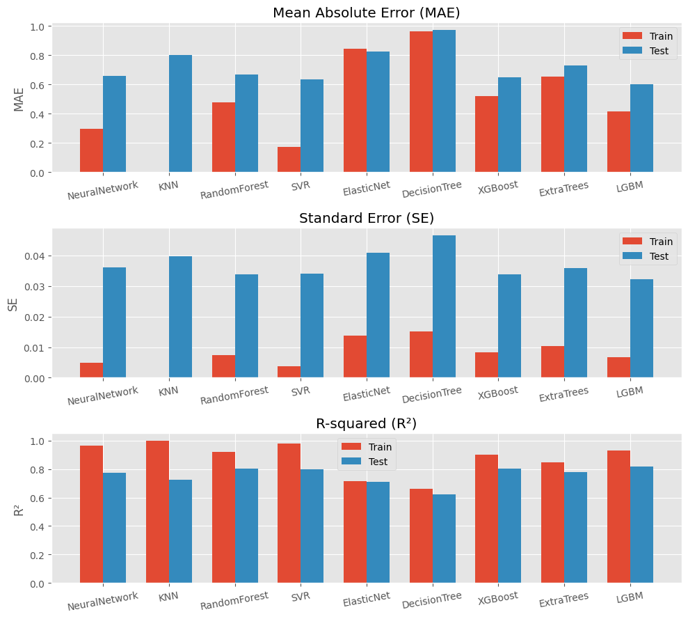

# Laporan Proyek Machine Learning - Jauhar Mumtaz

## Domain Proyek

Nilai kelarutan dalam air molekul organik merupakan salah satu kunci sifat fisik dalam dunia medis. Karena berbanding lurus dengan absorpsi yang merupakan parameter utama distribusi senyawa aktif biologi dalam makhluk hidup dan lingkungan, sehingga berpengaruh pada potensi bioavailability, efektifitas serta daya jual senyawa aktif tersebut.

Pengukuran kelarutan dalam air dengan akurasi tinggi tentu membutuhkan *cost* yang tidak kecil, mulai dari waktu, instruments, kelihaian penguji, serta sampel fisik yang terbatas. Beberapa metode perhitungan kelarutan dalam air (S) telah dikembangkan seperti *`General Solubility Equation (GSE)`* oleh [Sanghvi T *et al.* pada tahun 2003](https://pubs.acs.org/doi/10.1021/acs.molpharmaceut.4c00685)  dengan estimasi kelarutan dalam air (S) sebagai fungsi dari titik lebur (T) dan koefisien partisi oktanol-air (K):

  

Nilai partisi oktanol (`P`) dapat ditentukan berdasarkan struktur senyawa, namun penentuan titik lebur (`T`) masih memerlukan pengukuran lab. Sehingga metode GSE cocok untuk penentuan kelarutan dalam air suatu molekul jika tersedia data titik lebur-nya (`T`), sehingga metode yang dapat memanfaatkan struktur molekul untuk estimasi perlu dikembangkan.

Metode lain yang telah dikembangkan dengan menggunakan model machine learning yang dikembangkan oleh [Delaney JS pada tahun 2003](https://pubs.acs.org/doi/abs/10.1021/ci034243x), yaitu *`Estimated Solubility (ESOL)`* yang memanfaatkan delapan parameter yang diekstrak menggunakan *molecular descriptor* seperti *`clogP`*, *molecular weight (`molWT`)*, *rotatable bond (`rb`)*, *aromatic proportion (`ap`)*, *non-carbon proportion*, *H-bond donor (`hbd`)*, *H-bond acceptor (`hba`)*, dan *polar surface area (`psa`)*. Berdasarkan 2874 data latih ESOL menghasilkan estimasi yang lebih *robust* dibandingkan GSE dengan nilai:

||*R*²|SE|MAE|
|-|-|-|-|
|ESOL|0.69|1.01|0.75|
|GSE|0.67|1.05|0.47|

Metode ESOL juga menyimpulkan bahwa parameter paling signifikan yaitu *`clogP`* diikuti *molecular weight (`molWT`)*, *aromatic proportion (`ap`)*, dan *rotatable bond (`rb`)*. Dengan seiringnya perkembangan jaman, machine learning telah berkembang mulai dari beragamnya database, hyperparameter tuning, dan model, penulis ingin melanjutkan perkembangan estimasi nilai kelarutan molekul dalam air menggunakan dataset yang lebih besar dan hanya mengandalkan variabel `smiles` dan `log S` sebagai data `input` dan `label` utama degan menggunakan dataset [SMILES-enumeration-datasets](https://github.com/summer-cola/smiles-enumeration-datasets) dengan melakukan descriptor 0D, 1D, 2D, dam 3D pada variable `smiles` dan didapatkan total 31 parameter yang akan digunakan sebagai input beberapa model. 

Model regressor berbasis machine learning beserta deep learning seperti Neural Network (`NN`), K-Nearest Neighbors (`KNN`), Random Forest (`RF`), Support Vector Regressor (`SVR`), Elastic Net (`EN`), Decision Tree (`DT`), Extreme Gradient Boosting (`XGBoost`), Extra Trees (`ET`), dan Light Gradient-Boosting Machine (`LightGBM`). Tiga model terbaik berdasarkan nilai *Mean Absolute Error* (`MAE`) dan *Standard Error* (`SE`) rendah beserta Koefisien Determinasi (`R²`) akan dilakukan interpretasi model menggunakan SHapley Additive exPlanations (`SHAP`) sehingga didapatkan beberapa parameter paling signifikan.

## Business Understanding

### Problem Statements

* Memprediksi kelarutan dalam air `LogS` suatu molekul `*drug-like*` merupakan tahap utama dalam dunia `*drug discovery*` yang mana dapat mempengaruhi efisiensi dan pengembangan obat. Apakah prediksi `LogS` dapat dilakukan menggunakan model *Machine Learning* yang tersedia ataupun *Deep Learning* sederhana dengan menggunakan fitur yang diekstrak hanya dari anotasi `SMILES` suatu molekul?
* Di antara berbagai model *Machine Learning* yang tersedia ataupun *Deep Learning* sederhana, model manakah yang memiliki nilai *Mean Absolute Error* (MAE) dan *Standard Error* (SE) rendah beserta Koefisien Determinasi (R²) tinggi dalam memprediksi `LogS` berdasarkan fitur-fitur yang digunakan?
* Dari delapan fitur yang digunakan dalam publikasi [ESOL](https://pubs.acs.org/doi/abs/10.1021/ci034243x#) yang dapat diekstrak menggunakan deskriptor dari `SMILES`, fitur mana yang paling berpengaruh terhadap nilai `LogS`? Apakah terdapat fitur lain yang

### Goals

* Mengetahui prediksi LogS hanya dari ekstraksi fitur dari `SMILES` dapat dilakukan menggunakan model *Machine Learning* yang tersedia ataupun *Deep Learning* sederhana.
* Menentukan model *Machine Learning* yang tersedia ataupun Deep Learning sederhana dengan error terkecil untuk memprediksi nilai `LogS` berdasarkan fitur yang digunakan.
* Mengidentifikasi fitur yang memiliki pengaruh terbesar terhadap nilai `LogS` (kelarutan molekul dalam air).

### Solution statements

* Melakukan prediksi `LogS` dengan menggunakan fitur yang diekstrak hanya dari anotasi `SMILES` suatu molekul menggunakan model *Machine Learning* yang tersedia ataupun *Deep Learning* sederhana.
* Menguji dan mengevaluasi beberapa model dengan *hyperparameter* yang telah ditetapkan sebelumnya, dan menetapkan model terbaik berdasarkan metrik *Mean Absolute Error* (`MAE`), *Standard Error* (`SE`), dan koefisien Determinasi (`R²`).
* Mengekstrak bobot fitur dari beberapa model.

## Data Understanding

Dataset yang digunakan untuk memprediksi nilai `log S` suatu molekul diambil dari dataset GitHub yang dipublish oleh `summer-cola` dengan nama repository `SMILES-enumeration-datasets` yang dapat diakses melalui tautan [berikut](https://github.com/summer-cola/smiles-enumeration-datasets). Repository ini berisi beberapa dataset berisi sifat fisik suatu molekul seperti `log D`, `log P`, dan `log S`. Untuk dataset yang digunakan pada prediksi kali ini berada pada directory `logS` dengan nama file `traintest.csv` yang berisi 7954 baris data.

### Informasi Keterangan Variabel pada Dataset

Dataset memiliki 8 variabel dengan keterangan sebagai berikut.

| Variabel | Deskripsi | Nilai |
| - | - | - |
| Unnamed: 0 | Indeks otomatis yang dihasilkan saat data diimpor. | 0 |
| Compound ID | ID unik untuk mengidentifikasi setiap senyawa dalam dataset. | C4659 |
| InChIKey | Kode alfanumerik yang merupakan versi singkat dari InChI (International Chemical Identifier) untuk identifikasi molekul unik secara global. | WIKXJKUZYYOTBP-UHFFFAOYSA-N |
| SMILES  | Simplified molecular input line entry system, bentuk notasi untuk deskripsi struktur molekul menggunakan *short ASCII strings*. | CCCCC(COC(=O)N)(COC(=O)NC(C)C)C |
| logS | Nilai logaritmik dari kelarutan dalam air (S), yang mengindikasikan seberapa larut suatu senyawa dalam air. | -3.633501683 |
| logP | Nilai logaritmik dari koefisien partisi oktanol-air (P), yang menunjukkan lipofilisitas atau kecenderungan senyawa untuk larut dalam lemak atau air. | 3.504 |
| MW  | Massa molekul (Molecular Weight), yaitu total massa atom dari molekul dalam satuan dalton (Da). | 274.357 |
| smi | Representasi alternative SMILES | C C C C C ( C O C ( = O ) N ) ( C O C ( = O ) N C ( C ) C ) C |

Dengan memanfaatkan `Descriptor` `0D`, `1D`, `2D`, dan `3D` variabel yang digunakan pada dari dataset yaitu `smiles` sebagai data `input mentah` dan `logS` sebagai `label`. Setelah dilakukan `Descriptor` pada variabel `smiles` didapatkan 31 variabel baru beserta keterangannya sebagai berikut.

| Variabel | Deskripsi | Nilai |
| - | - | - |
| logS | LogS, nilai logaritmik kelarutan molekul (terutama obat) dalam air | -2.74 |
| molWt | Molecule weight, berat molekul | 170.92 |
| numAtoms | Jumlah atom berat (selain hidrogen dalam molekul). | 8 |
| molMR | Molecular refractivity, kemampuan molekul untuk membiaskan cahaya, terkait dengan polarizabilitas molekul. |  21.6 |
| rings | Jumlah cincin dalam struktur molekul | 0 |
| aromatic | Jumlah cincin dengan sifat aromatik dalam molekul. | 0 |
| ap | Aromatic proportion, rasio atom aromatik terhadap total atom. | 0.0 |
| chiralC | Jumlah pusat kiral (Karbon) dalam molekul. | 0 |
| logP | Koefisien partisi logaritmik mengukur kepolaran molekul. | 2.6496 |
| hbd | Jumlah donor ikatan hidrogen | 0 |
| hba | Jumlah akseptor ikatan hidrogen | 0 |
| rb | Rotatable bond, umlah ikatan rotasi| 1 |
| tpsa | Topological polar surface area, luas permukaan molekul yang bersifat polar | 0.0 |
| nh2 |  Jumlah gugus amina | 0 |
| oh | Jumlah gugus hidroksil | 0 |
| balabanJ | Indeks Balaban (Balaban J Index), ukuran kekompakan topologi molekul. | 4.020392 |
| bertzCT | Kompleksitas topologi Bertz (Bertz CT), ukuran kerumitan molekul berdasarkan struktur graf. | 67.01955 |
| hallKierAlpha |  Indeks Hall-Kier Alpha, terkait dengan bentuk molekul dan polarizabilitasnya. | 0.3 |
| ipc | Indeks polaritas informasi (Information Content Index), mengukur keragaman struktur molekul. |  21.306059 |
| chi1 | Chi Path Index 0, pengukuran topologi molekul berdasarkan jumlah dan jenis atom. | 7.0 |
| chi2 | Chi Path Index 1, pengukuran jalur molekul berdasarkan pola ikatan atom. |  3.25 |
| kappa1 | Indeks kappa molekuler 1, mengukur fleksibilitas molekul. | 8.3 |
| kappa2 | Indeks kappa molekuler 2, variasi lain untuk mengukur fleksibilitas molekul. |  1.91511 |
| kappa3 | Indeks kappa molekuler 3, variasi lebih lanjut dari pengukuran fleksibilitas.| 2.046098 |
|fractionCSP3 | Fraksi atom karbon dalam hibridisasi sp3 | 1.0|
| asphericity |  Asferisitas, pengukuran penyimpangan bentuk molekul dari bentuk bola sempurna. | 0.072556 |
| eccentricity | Eksentrisitas, pengukuran asimetri dalam distribusi atom molekul. | 0.785158 |
| inertialShapeFactor | Faktor bentuk inersia, yang menunjukkan bentuk molekul berdasarkan distribusi massa atom. | 0.003042 |
| radiusOfGyration | Jari-jari perputaran (Radius of Gyration), mengukur penyebaran atom dalam molekul relatif terhadap pusat massa. | 1.836359 |
| spherocityIndex | Indeks sferisitas, yang menunjukkan seberapa dekat bentuk molekul dengan bola. | 0.711911 |
| ncp | Proporsi non-karbon terhadap total atom dalam molekul. | 0.75 |
| ecfp | Extended Circular Fingerprints, representasi molekul berbasis bit. | [0, 0, 0, 0, 0, 0, 0, 0, 0, 0, 0, 0, 0, 0, 0, ... ] |

Berikut merupakan keterangan tipe data pada dataset.

| Tipe Data | Variabel | Keterangan |
| - | - | - |
| Float | logS, molWt, molMR, ap, logP, tpsa, balabanJ, bertzCT, hallKierAlpha, ipc, chi0, chi1, kappa1, kappa2, kappa3, fractionCSP3, asphericity, eccentricity, inertialShapeFactor, radiusOfGyration, spherocityIndex, dan ncp | Data hasil kalkulasi matematis dan fraksi. |
| Integer | numAtoms, rings, aromatic, chiralC, hbd, hba, rb, nh2, dan oh | Data penjumlahan satuan |
| List | ecfp | Data berisi 2048 bit interpretasi molekul.  |

## Data Cleaning

### Drop Data Duplikat

Setelah dilakukan pengecekan data `Null`, `NaN` dan data duplikat hanya ditemukan `1` data duplikat sehingga dilakukan `drop`.

### Deskripsi Statistik. 

<table border="1" class="dataframe">
  <thead>
    <tr style="text-align: right;">
      <th></th>
      <th>logS</th>
      <th>molWt</th>
      <th>numAtoms</th>
      <th>molMR</th>
      <th>rings</th>
      <th>aromatic</th>
      <th>ap</th>
      <th>chiralC</th>
      <th>logP</th>
      <th>hbd</th>
      <th>...</th>
      <th>kappa1</th>
      <th>kappa2</th>
      <th>kappa3</th>
      <th>fractionCSP3</th>
      <th>asphericity</th>
      <th>eccentricity</th>
      <th>inertialShapeFactor</th>
      <th>radiusOfGyration</th>
      <th>spherocityIndex</th>
      <th>ncp</th>
    </tr>
  </thead>
  <tbody>
    <tr>
      <th>count</th>
      <td>7954.000000</td>
      <td>7954.000000</td>
      <td>7954.000000</td>
      <td>7954.000000</td>
      <td>7954.000000</td>
      <td>7954.000000</td>
      <td>7954.000000</td>
      <td>7954.00000</td>
      <td>7954.000000</td>
      <td>7954.000000</td>
      <td>...</td>
      <td>7954.000000</td>
      <td>7954.000000</td>
      <td>7954.000000</td>
      <td>7954.000000</td>
      <td>7954.000000</td>
      <td>7954.000000</td>
      <td>7954.000000</td>
      <td>7.954000e+03</td>
      <td>7954.000000</td>
      <td>7954.000000</td>
    </tr>
    <tr>
      <th>mean</th>
      <td>-2.981528</td>
      <td>292.151987</td>
      <td>19.181795</td>
      <td>75.840784</td>
      <td>1.975107</td>
      <td>1.195248</td>
      <td>0.352023</td>
      <td>0.97297</td>
      <td>1.912550</td>
      <td>1.239125</td>
      <td>...</td>
      <td>3.924647</td>
      <td>6.902837</td>
      <td>5.105968</td>
      <td>0.459514</td>
      <td>0.392271</td>
      <td>0.937606</td>
      <td>0.002492</td>
      <td>3.618187e+00</td>
      <td>0.250457</td>
      <td>0.270458</td>
    </tr>
    <tr>
      <th>std</th>
      <td>2.200720</td>
      <td>138.909559</td>
      <td>9.048712</td>
      <td>34.724211</td>
      <td>1.461655</td>
      <td>0.982673</td>
      <td>0.260995</td>
      <td>2.21534</td>
      <td>2.510816</td>
      <td>1.513059</td>
      <td>...</td>
      <td>2.528799</td>
      <td>4.207856</td>
      <td>22.793668</td>
      <td>0.301113</td>
      <td>0.193149</td>
      <td>0.065069</td>
      <td>0.010385</td>
      <td>1.462360e+00</td>
      <td>0.161920</td>
      <td>0.133211</td>
    </tr>
    <tr>
      <th>min</th>
      <td>-16.259392</td>
      <td>16.043000</td>
      <td>1.000000</td>
      <td>0.000000</td>
      <td>0.000000</td>
      <td>0.000000</td>
      <td>0.000000</td>
      <td>0.00000</td>
      <td>-46.668600</td>
      <td>0.000000</td>
      <td>...</td>
      <td>0.000000</td>
      <td>0.000000</td>
      <td>-27.040000</td>
      <td>0.000000</td>
      <td>0.000000</td>
      <td>0.000000</td>
      <td>0.000000</td>
      <td>3.469447e-18</td>
      <td>0.000000</td>
      <td>0.000000</td>
    </tr>
    <tr>
      <th>25%</th>
      <td>-4.259388</td>
      <td>197.190000</td>
      <td>13.000000</td>
      <td>51.231650</td>
      <td>1.000000</td>
      <td>0.000000</td>
      <td>0.000000</td>
      <td>0.00000</td>
      <td>0.779440</td>
      <td>0.000000</td>
      <td>...</td>
      <td>2.475306</td>
      <td>4.088493</td>
      <td>2.171001</td>
      <td>0.235294</td>
      <td>0.239931</td>
      <td>0.913155</td>
      <td>0.000463</td>
      <td>2.823452e+00</td>
      <td>0.131913</td>
      <td>0.181818</td>
    </tr>
    <tr>
      <th>50%</th>
      <td>-2.824600</td>
      <td>273.798500</td>
      <td>18.000000</td>
      <td>72.044850</td>
      <td>2.000000</td>
      <td>1.000000</td>
      <td>0.375000</td>
      <td>0.00000</td>
      <td>2.045950</td>
      <td>1.000000</td>
      <td>...</td>
      <td>3.534830</td>
      <td>6.038287</td>
      <td>3.400000</td>
      <td>0.428571</td>
      <td>0.374412</td>
      <td>0.957519</td>
      <td>0.001016</td>
      <td>3.473871e+00</td>
      <td>0.230156</td>
      <td>0.250000</td>
    </tr>
    <tr>
      <th>75%</th>
      <td>-1.489481</td>
      <td>359.713500</td>
      <td>23.000000</td>
      <td>93.985125</td>
      <td>3.000000</td>
      <td>2.000000</td>
      <td>0.545455</td>
      <td>1.00000</td>
      <td>3.401700</td>
      <td>2.000000</td>
      <td>...</td>
      <td>4.818714</td>
      <td>8.679717</td>
      <td>5.344128</td>
      <td>0.666667</td>
      <td>0.532319</td>
      <td>0.981270</td>
      <td>0.002296</td>
      <td>4.223524e+00</td>
      <td>0.347257</td>
      <td>0.333333</td>
    </tr>
    <tr>
      <th>max</th>
      <td>1.580000</td>
      <td>1583.582000</td>
      <td>109.000000</td>
      <td>370.217200</td>
      <td>16.000000</td>
      <td>12.000000</td>
      <td>1.000000</td>
      <td>27.00000</td>
      <td>20.854600</td>
      <td>19.000000</td>
      <td>...</td>
      <td>72.265273</td>
      <td>62.805231</td>
      <td>1128.960000</td>
      <td>1.000000</td>
      <td>1.000000</td>
      <td>1.000000</td>
      <td>0.339204</td>
      <td>5.985842e+01</td>
      <td>0.999963</td>
      <td>1.000000</td>
    </tr>
  </tbody>
</table>

8 rows × 31 columns

Dari deskripsi data statistik di atas, dapat disimpulkan bahwa sebaran data `mean`, `Q2`, dan `std` yang bervariatif. Outlier diperiksa menggunakan 8 variabel yang digunakan pada penelitian `ESOL` sebagai berikut.

  
  Box plot outlier pada variabel yang digunakan <b>ESOL</b>.

Interpretasi Outlier :

1. `log P` : Sebaran data terpusat pada rentang `0.8 - 3.5` dari rentang `-46.6 - 20.8`.
2. `molWt` : Sebaran data terpusat pada rentang `197.1 - 359.7` dari rentang `16 - 1583.5`.
3. `rb` : Sebaran data terpusat pada rentang `3 - 9` dari rentang `0 - 59`.
4. `ap` : Sebaran data terpusat pada rentang `0 - 0.5` dari rentang `0 - 1`.
5. `ncp` : Sebaran data terpusat pada rentang `0.1 - 0.3` dari rentang `0 - 1`.
6. `hbd` : Sebaran data terpusat pada rentang `0 - 2` dari rentang `0 - 19`.
7. `hba` : Sebaran data terpusat pada rentang `2 - 4` dari rentang `0 - 35`.
8. `tpsa` : Sebaran data terpusat pada rentang `25.3 - 71.4` dari rentang `25.3 - 601.8`.

Yang dapat diartikan bahwa outlier merupakan interpretasi nilai fisika molekuler berdasarkan strukturnya, sehingga dimungkinkan terdapatnya outlier dan tidak dilakukan penghapusan outlier yang dapat berakibat hilangnya sebagian besar dataset.

### Univariate - Numerical Features

   

  <small>Plot histogram variabel <b>logS</b> sebagai label.</small>

Berdasarkan sebaran label `logS` di atas, persebaran terpusat pada rentang `-7 - 0.1` yang memiliki `≥100` dataset yang merupakan daerah antara *poorly* hingga *highly Solubility* dari skala [SwissADME](https://www.nature.com/articles/srep42717).

  

   

  Plot histogram variabel input.

Pengamatan Umum:

* Skewness: Banyak fitur menunjukkan distribusi yang miring ke kanan, mengindikasikan ekor panjang ke arah nilai yang lebih tinggi.
* Clustering: Fitur seperti `rings`, `hbd`, `hba`, `rb`, dan `chio` menunjukkan cluster yang berbeda, yang mengindikasikan kelompok tertentu dalam data.
* Distribusi Normal: Beberapa fitur seperti `ap` dan `tpsa` tampak mengikuti distribusi normal.

Pemahaman Fitur Spesifik:

* Sifat Molekuler: Fitur seperti `molWt`, `numAtoms`, dan `molMR` menunjukkan korelasi positif, mengindikasikan molekul yang lebih besar cenderung memiliki nilai yang lebih tinggi.
* Ikatan Hidrogen: `hbd` dan `hba` tampaknya memiliki korelasi negatif, menunjukkan bahwa molekul dengan lebih banyak donor ikatan hidrogen mungkin memiliki lebih sedikit akseptor.
* Struktur Cincin: `rings` dan `aromatic` merupakan fitur terkait, dikarenakan dengan cincin aromatik masuk kategori cincin namun tidak berlaku untuk sebaliknya.
* Deskripsi Bentuk: Fitur seperti `asphericity`, `eccentricity`, dan `spherocityIndex` memberikan wawasan tentang bentuk dan distribusi molekul.

### Multivariate - Numerical Features

  

  Plot matriks korelasi antar variabel.

Korelasi Positif `Kuat` dengan LogS:

* Molekul yang lebih besar (`berat molekul`, `jumlah atom`, dan `refraksi molar` yang lebih `tinggi`) cenderung memiliki `kelarutan` yang lebih `rendah`.
* Molekul yang lebih `kompleks` dengan `cincin` dan struktur `aromatik` cenderung memiliki `kelarutan` yang lebih `rendah` karena terjadi `resonansi` atau `stabilisasi PEB (Pasangan Elektron Bebas}`.

Korelasi Positif `Sedang` dengan LogS:

* Molekul yang lebih `lipofilik` (`logP` lebih `tinggi`) cenderung memiliki `kelarutan` yang lebih `rendah`.
* Molekul dengan `luas permukaan polar` yang lebih `besar` cenderung memiliki `kelarutan` yang lebih `rendah`.

Korelasi `Lemah` atau `Tidak Signifikan` dengan LogS:

* Banyak deskriptor molekuler lainnya memiliki korelasi `lemah` atau `tidak signifikan` dengan LogS. Ini menunjukkan bahwa fitur-fitur ini mungkin `tidak terlalu berpengaruh` dalam memprediksi kelarutan.

Korelasi `tinggi` antar deskriptor:

* Banyaknya fitur yang memiliki korelasi positif seperti `molWt`, `numAtoms`, `molWt`, `bertzCT`, `chi0`, dan `chi1`. Fitur-fitur tersebut diduga memiliki bobot nilai yang sama kuat pada prediksi `logS` pada model.

## Data Preparation

### Unpack List Feature

Unpack list feature dilakukan terhadap variabel `ecfp` karena berisi list 2048 `1` untuk `True` dan `0` untuk `False` sehingga didapatkan 2048 kolom baru untuk masing-masing interpretasi yang berisi nilai `1` untuk `True` atau `0` untuk `False`.

### Data Splitting Train dan Test

Dataset `Input` dan `Label` dibagi menjadi 2 kategori yaitu:

* Train : Sebagai data latih model.
* Test : Sebagai data validasi model dan matriks evaluasi.
Pembagian data dilakukan dengan perbandingan `90:10` dari `7953` dataset, sehingga memiliki bentuk seperti berikut:

    * Data Train  : (`7157`, `2078`)
    * Label Train : (`7157`,)
    * Data Test   : (`796`, `2078`)
    * Label Test  : (`796`,)

### Scaling dan Normalization

Tahap ini dilakukan pada variabel dengan tipe `float` saja, dikarenakan kebanyakan variabel dengan tipe `int` merupakan penjumlahan satuan bilangan bulat dan menghindari perubahan `bobot` dari variabel itu tersendiri.

Scaling dan Normalization dilakukan pada beberapa `algoritma` sebagai berikut:

| Algoritma | Deskripsi | FormulaMatematis | Efek pada Data |
|-|-|-|-| 
| **Standard Scaler** | Skala data agar memiliki mean 0 dan standar deviasi 1. Berguna ketika data mengikuti distribusi normal. |  | Menyelaraskan data (mean = 0) dengan variansi 1 (std = 1). |
| **Min Max Scaler** | Mengubah skala data ke rentang tertentu (default 0 hingga 1). Berguna untuk transformasi dalam batas tertentu. |  | Menggeser dan menskalakan data agar sesuai dalam rentang tertentu, biasanya [0, 1]. |
| **Robust Scaler** | Menggunakan median dan interquartile range (IQR) untuk mengurangi pengaruh outlier dalam skala data. |  | Menyelaraskan data menggunakan median dan menskalakan berdasarkan IQR, mengurangi dampak outlier. |
| **Quantile Transformer Normal** | Mengubah data agar mengikuti distribusi normal. Menerapkan transformasi peringkat, berguna untuk data non-Gaussian. |  | Membuat distribusi data menjadi normal, menggeser mean dan standar deviasi. |
| **Quantile Transformer Unifrom** | Mengubah data agar mengikuti distribusi uniform. Berguna untuk membuat distribusi lebih seragam. |  | Mengubah data menjadi sebaran seragam, tanpa terpusat pada mean. |
| **Power Transformer** | Menerapkan transformasi daya (Yeo-Johnson) untuk menstabilkan variansi dan membuat data lebih mendekati distribusi Gaussian. |  | Menggeser dan menskalakan data, sering kali mengurangi skewness untuk mendekati distribusi Gaussian. |

**Dimana:**

- xi : Nilai asli dalam dataset yang sedang diskalakan atau ditransformasi.
- x : Semua titik data asli dalam dataset.
- zi: Nilai yang ditransformasikan atau diskalakan dari xi setelah menerapkan scaler atau transformasi.
- μ : Rata-rata dari semua titik data x.
- σ : Deviasi standar dari semua titik data x.
- Q1 : Kuartil pertama (persentil ke-25) dari dataset x.
- Q2 : Kuartil kedua (median atau persentil ke-50) dari dataset x.
- Q3 : Kuartil ketiga (persentil ke-75) dari dataset x.
- min(x) : Nilai minimum dalam dataset x.
- max(x) : Nilai maksimum dalam dataset x.
- λ : Parameter transformasi dalam Power Transformer (Yeo-Johnson), ditentukan melalui Estimasi Likelihood Maksimum (MLE).
- ϕ-1 : Fungsi distribusi kumulatif terbalik (fungsi kuantil).

Dengan `algoritma` terbaik dengan score `Negative Mean Squared Error (Negative MSE)` : `-1.4793369599164947`, `QuantileTransformer` dengan distribusi `Uniform` dipilih untuk melakukan `Normalization` pada data `float`.

<table>
    <thead>
        <tr>
            <th></th>
            <th>molWt</th>
            <th>molMR</th>
            <th>ap</th>
            <th>logP</th>
            <th>tpsa</th>
            <th>balabanJ</th>
            <th>bertzCT</th>
            <th>hallKierAlpha</th>
            <th>ipc</th>
            <th>chi0</th>
            <th>...</th>
            <th>kappa1</th>
            <th>kappa2</th>
            <th>kappa3</th>
            <th>fractionCSP3</th>
            <th>asphericity</th>
            <th>eccentricity</th>
            <th>inertialShapeFactor</th>
            <th>radiusOfGyration</th>
            <th>spherocityIndex</th>
            <th>ncp</th>
        </tr>
    </thead>
    <tbody>
        <tr>
            <td>count</td>
            <td>7157.0000</td>
            <td>7157.0000</td>
            <td>7157.0000</td>
            <td>7157.0000</td>
            <td>7157.0000</td>
            <td>7157.0000</td>
            <td>7157.0000</td>
            <td>7157.0000</td>
            <td>7157.0000</td>
            <td>7157.0000</td>
            <td>...</td>
            <td>7157.0000</td>
            <td>7157.0000</td>
            <td>7157.0000</td>
            <td>7157.0000</td>
            <td>7157.0000</td>
            <td>7157.0000</td>
            <td>7157.0000</td>
            <td>7157.0000</td>
            <td>7157.0000</td>
            <td>7157.0000</td>
        </tr>
        <tr>
            <td>mean</td>
            <td>0.0000</td>
            <td>0.0000</td>
            <td>-1.0508</td>
            <td>0.0001</td>
            <td>-0.1798</td>
            <td>0.0003</td>
            <td>-0.0002</td>
            <td>-0.0004</td>
            <td>-0.0005</td>
            <td>-0.0001</td>
            <td>...</td>
            <td>-0.0001</td>
            <td>-0.0005</td>
            <td>0.0003</td>
            <td>0.0175</td>
            <td>-0.0008</td>
            <td>-0.0002</td>
            <td>-0.0004</td>
            <td>-0.0002</td>
            <td>-0.0073</td>
            <td>-0.0452</td>
        </tr>
        <tr>
            <td>std</td>
            <td>1.0020</td>
            <td>1.0018</td>
            <td>2.6046</td>
            <td>1.0016</td>
            <td>1.5030</td>
            <td>1.0010</td>
            <td>1.0033</td>
            <td>1.0023</td>
            <td>1.0011</td>
            <td>1.0025</td>
            <td>...</td>
            <td>1.0016</td>
            <td>1.0035</td>
            <td>1.0024</td>
            <td>2.3954</td>
            <td>1.0058</td>
            <td>1.0045</td>
            <td>1.0051</td>
            <td>1.0028</td>
            <td>1.0329</td>
            <td>1.1672</td>
        </tr>
        <tr>
            <td>min</td>
            <td>-5.1993</td>
            <td>-5.1993</td>
            <td>-5.1993</td>
            <td>-5.1993</td>
            <td>-5.1993</td>
            <td>-5.1993</td>
            <td>-5.1993</td>
            <td>-5.1993</td>
            <td>-5.1993</td>
            <td>-5.1993</td>
            <td>...</td>
            <td>-5.1993</td>
            <td>-5.1993</td>
            <td>-5.1993</td>
            <td>-5.1993</td>
            <td>-5.1993</td>
            <td>-5.1993</td>
            <td>-5.1993</td>
            <td>-5.1993</td>
            <td>-5.1993</td>
            <td>-5.1993</td>
        </tr>
        <tr>
            <td>25%</td>
            <td>-0.6743</td>
            <td>-0.6748</td>
            <td>-5.1993</td>
            <td>-0.6738</td>
            <td>-0.6737</td>
            <td>-0.6750</td>
            <td>-0.6748</td>
            <td>-0.6769</td>
            <td>-0.6749</td>
            <td>-0.6737</td>
            <td>...</td>
            <td>-0.6763</td>
            <td>-0.6744</td>
            <td>-0.6751</td>
            <td>-0.6784</td>
            <td>-0.6741</td>
            <td>-0.6749</td>
            <td>-0.6740</td>
            <td>-0.6740</td>
            <td>-0.6751</td>
            <td>-0.6518</td>
        </tr>
        <tr>
            <td>50%</td>
            <td>-0.0009</td>
            <td>0.0006</td>
            <td>-0.0125</td>
            <td>-0.0003</td>
            <td>-0.0013</td>
            <td>0.0001</td>
            <td>-0.0005</td>
            <td>-0.0088</td>
            <td>0.0005</td>
            <td>-0.0000</td>
            <td>...</td>
            <td>0.0010</td>
            <td>0.0002</td>
            <td>-0.0008</td>
            <td>-0.0038</td>
            <td>-0.0008</td>
            <td>-0.0006</td>
            <td>0.0004</td>
            <td>-0.0005</td>
            <td>0.0002</td>
            <td>0.0100</td>
        </tr>
        <tr>
            <td>75%</td>
            <td>0.6737</td>
            <td>0.6742</td>
            <td>0.7250</td>
            <td>0.6745</td>
            <td>0.6743</td>
            <td>0.6751</td>
            <td>0.6744</td>
            <td>0.6737</td>
            <td>0.6741</td>
            <td>0.6743</td>
            <td>...</td>
            <td>0.6751</td>
            <td>0.6747</td>
            <td>0.6756</td>
            <td>0.6911</td>
            <td>0.6742</td>
            <td>0.6742</td>
            <td>0.6752</td>
            <td>0.6747</td>
            <td>0.6746</td>
            <td>0.6211</td>
        </tr>
        <tr>
            <td>max</td>
            <td>5.1993</td>
            <td>5.1993</td>
            <td>5.1993</td>
            <td>5.1993</td>
            <td>5.1993</td>
            <td>5.1993</td>
            <td>5.1993</td>
            <td>5.1993</td>
            <td>5.1993</td>
            <td>5.1993</td>
            <td>...</td>
            <td>5.1993</td>
            <td>5.1993</td>
            <td>5.1993</td>
            <td>5.1993</td>
            <td>5.1993</td>
            <td>5.1993</td>
            <td>5.1993</td>
            <td>5.1993</td>
            <td>5.1993</td>
            <td>5.1993</td>
        </tr>
    </tbody>
</table>

Data `train` dengan dtype `float` telah berhasil dilakukan transformasi menggunakan`QuantileTransformer Normal` dengan menseragamkan sebaran sehingga tidak terpusat pada `mean` hal ini ditandai oleh pembatasan sebaran pada nilai `min` dan `max` menjadi `-5.1993` dan `5.1993`, Hampir secara keseluruhan `Persentil Data` `50%` tepat berada di antara `25%` dan `75%` (`-0.6743`, `-0.0009` dan `0.6737`) serta nilai `mean` dan `50%` yang saling berdekatan (`0.0000` dan `-0.0009`). Selanjutnya, nilai transformasi data `train` diterapkan pada data `test` sehingga dimungkinkan adanya nilai transformasi di luar dari data `train` sehingga model dapat menghindari `overfitting`.

## Modeling

Terdapat 8 algoritma Machine Learning dan 1 algoritma Deep Learning yang digunakan untuk membuat model, yaitu:

| Model | Deskripsi | Penanganan Fitur | Risiko Overfitting | Cocok untuk Dimensi Tinggi? | Kemungkinan Performa-nya Baik |
|-|-|-|-|-|-|
| **Neural Network**  | Model berbasis lapisan neuron; cocok untuk kompleksitas tinggi dengan tuning | Baik dengan fitur banyak, perlu penyesuaian hati-hati | Sedang-Tinggi      | Ya, jika diatur regulerisasi-nya | **Sedang**: Potensi tinggi, tetapi berisiko overfitting dengan data terbatas |
| **K-Nearest Neighbors** (KNN) | Model berbasis jarak yang sederhana; performa turun pada dimensi tinggi | Kesulitan dengan dimensi tinggi | Rendah | Tidak | **Rendah**: Kemungkinan underperform karena masalah dimensi tinggi |
| **Random Forest** (RF) | Model ensemble berbasis pohon yang tahan noise dan mudah digunakan         | Menangani banyak fitur dengan baik | Rendah (karena rata-rata ensemble) | Ya | **Tinggi**: Efektif dengan data berdimensi tinggi dan fitur biner |
| **Support Vector Regression** (SVR) | Model berbasis margin maksimal; sensitif pada kernel dan hyperparameter     | Efektif di dimensi tinggi, perlu penyesuaian | Sedang | Ya, tetapi sensitif terhadap kernel | **Sedang**: Dapat bagus, tetapi butuh penyesuaian parameter |
| **ElasticNet** (EN) | Kombinasi regularisasi L1 (Lasso) dan L2 (Ridge); cocok untuk sparsitas data | Cocok untuk data sparsi dan berdimensi tinggi | Sedang | Ya | **Sedang**: Membutuhkan tuning; bagus jika terdapat sparsitas |
| **Decision Tree** (DT) | Model pohon sederhana; sering overfit tanpa pruning                      | Sederhana tetapi mudah overfit | Tinggi | Tidak | **Sedang-Rendah**: Mungkin kesulitan dengan dataset kecil dan overfitting |
| **XGBoost** (XGB) | Gradient boosting yang sangat cepat dan efisien; populer untuk kompetisi      | Sangat baik untuk data berdimensi tinggi | Rendah | Ya | **Tinggi**: Kandidat kuat karena ketangguhan dan seleksi fitur |
| **Extra Trees** (ET) | Variasi Random Forest; lebih cepat karena splitting acak                   | Mirip RF tetapi kurang rentan terhadap noise | Rendah | Ya | **Tinggi**: Andal dan efisien untuk tipe data ini |
| **LightGBM** (LGBM) | Model boosting berbasis histogram; sangat efisien untuk dataset besar       | Sangat baik untuk fitur biner/kategori berdimensi tinggi | Rendah | Ya | **Tinggi**: Kandidat kuat, efisien untuk fitur biner |

### Sifat Model

1. **Kontrol Overfitting**: Model ensemble seperti `RandomForest`, `ExtraTrees`, `XGBoost`, dan `LightGBM` memiliki metode bawaan untuk mencegah overfitting, sehingga cocok untuk dataset kecil dengan dimensi tinggi.
2. **Penanganan Fitur Biner**: Model seperti `LightGBM` dan `XGBoost` sangat efisien dengan fitur sparsi atau biner, seperti fingerprint `ECFP`.
3. **Sensitivitas Dimensi**: `KNN` dan `Decision Trees` sering mengalami kesulitan dengan dimensi tinggi, sehingga kemungkinan performanya kurang baik pada dataset ini.

### Hipotesis

* **Pilihan Terbaik**: `RandomForest`, `ExtraTrees`, `XGBoost`, dan `LightGBM` karena ketahanan dan kemampuannya untuk menggeneralisasi dengan baik pada dataset kecil.
* **Underperform**: `KNN` dan `Decision Trees` untuk data berdimensi tinggi ini, kecuali jika direduksi melalui teknik seperti PCA.

### Hyperparameter

| Model | Parameter | Range/Choices | Optimal Value |
|-|-|-|-|
| **NeuralNetR** | epochs | 34 - 35 | 34 |
|                | patience | 5 - 6 | 5 |
|                | batch_size | 89 - 90 | 89 |
|                | lr | 9e-4 - 2e-3 | 0.0023 |
|                | weight_decay | 5e-5 - 6e-5 | 0.0001 |
| | | | |
| **KNN**        | n_neighbors | 5 - 6 | 5 |
|                | p | 1 - 2 | 1 |
|                | weights | ['uniform', 'distance'] | distance |
| | | | |
| **RandomForest** | n_estimators | 95 - 96 | 96 |
|                | max_depth | 11 - 12 | 12 |
|                | min_samples_split | 3 - 4 | 4 |
|                | min_samples_leaf | 1 - 2 | 1 |
|                | bootstrap | [True, False] | True |
| | | | |
| **SVR**        | C | 47 - 48 | 48 |
|                | epsilon | 0.1 - 0.3 | 0.247 |
|                | gamma | ['scale', 'auto'] | scale |
|                | kernel | ['rbf', 'linear'] | rbf |
| | | | |
| **ElasticNet** | alpha | 0.1 - 0.2 | 0.101 |
|                | l1_ratio | 0.2 - 0.3 | 0.234 |
| | | | |
| **DecisionTree** | max_depth | 3 - 5 | 4 |
|                | min_samples_split | 3 - 4 | 3 |
|                | min_samples_leaf | 2 - 3 | 2 |
| | | | |
| **XGBoost**    | n_estimators | 179 - 180 | 179 |
|                | learning_rate | 0.09 - 0.15 | 0.092 |
|                | max_depth | 4 - 5 | 4 |
|                | min_child_weight | 1 - 2 | 1 |
| | | | |
| **ExtraTrees** | n_estimators | 198 - 199 | 199 |
|                | max_depth | 8 - 9 | 8 |
|                | min_samples_split | 2 - 3 | 2 |
|                | min_samples_leaf | 3 - 4 | 4 |
|                | bootstrap | [True, False] | False |
| | | | |
| **LightGBM**   | n_estimators | 119 - 120 | 119 |
|                | learning_rate | 0.1 - 0.2 | 0.15 |
|                | max_depth | 10 - 11 | 10 |
|                | num_leaves | 23 - 24 | 23 |
|                | min_child_weight | 1 - 2 | 1 |
|                | colsample_bytree | 0.8 - 0.9 | 0.9 |
|                | min_data_in_leaf | 29 - 30 | 29 |
|                | min_gain_to_split | 0.07 - 0.08 | 0.072 |

`Range` Hyperparameter cukup sempit dikarenakan merupakan `validasi` terakhir setelah dilakukan `Tunning` pada beberapa `range` secara bertahap. 

## Evaluation

### Matriks MAE, SE, dan R²

Evaluasi model menggunakan tiga parameter yaitu Mean Absolute Error (MAE), Squared Error (SE), dan R-squared (R²)

#### Mean Absolute Error (MAE)

- **Definisi**: MAE adalah rata-rata selisih absolut antara nilai aktual dan prediksi. Metrik ini memberikan ukuran sederhana dari kesalahan prediksi, tanpa memperhatikan arah kesalahan.
- **Rumus**: 
  

    
  

- **Interpretasi**: MAE mudah dipahami karena menunjukkan rata-rata besar kesalahan dalam satuan variabel yang diminati. Nilai yang lebih rendah menunjukkan akurasi model yang lebih baik.

#### Squared Error (SE)

- **Definisi**: SE adalah jumlah selisih kuadrat antara nilai aktual dan prediksi. Metrik ini memberi bobot lebih pada kesalahan yang lebih besar, menjadikannya berguna untuk model yang ingin meminimalkan deviasi besar.
- **Rumus**: 
  

    
  

- **Interpretasi**: SE memberikan bobot yang lebih besar pada kesalahan besar, sehingga bermanfaat dalam identifikasi model yang dapat mengurangi deviasi yang signifikan. SE biasanya digunakan sebagai perhitungan antara (misalnya, untuk MSE atau RMSE) dan tidak memberikan ukuran langsung seperti MAE.

#### R-squared (R²)

- **Definisi**: R² menggambarkan proporsi variansi dalam variabel target yang dapat diprediksi dari fitur. Ini mengukur seberapa baik model menangkap variabilitas data.
- **Rumus**: 
  

    
  

- **Interpretasi**: R² berkisar antara 0 hingga 1, di mana 1 menunjukkan prediksi sempurna. Nilai yang lebih tinggi menunjukkan performa model yang lebih baik karena menunjukkan bahwa model dapat menjelaskan sebagian besar variansi dalam variabel target.

### Keterangan:
- yi : Nilai aktual yang diamati.
- ŷi : Nilai yang diprediksi.
- ȳi : Rata-rata dari nilai aktual yang diamati.
- n : Jumlah total data.
- ∑ : Operator penjumlahan.
- ∣⋅∣ : Fungsi nilai mutlak.

  
  Plot bar matriks evaluasi (<b>MAE</b>, <b>SE</b>, dan <b>R²</b>) masing-masing model.

- **Model Terbaik Secara Keseluruhan:** `SVR` dan `ElasticNet (EN)` menunjukkan generalisasi terbaik di semua metrik (MAE, SE, \(R^2\)), menjadikannya pilihan yang paling dapat diandalkan untuk data pengujian.  
- **Model Kuat tetapi Sedikit Overfit:** `NeuralNetwork (nnR)`, `RandomForest (rfR)`, `ExtraTrees (etR)`, dan `XGBoost (xgbR)` memiliki performa baik namun menunjukkan sedikit overfitting, yang masih dapat diperbaiki dengan optimasi lebih lanjut.  
- **Model yang Overfit:** `KNN (knnR)` dan `DecisionTree (dtR)` menunjukkan tanda overfitting yang signifikan dengan generalisasi yang buruk pada data uji, sehingga memerlukan perbaikan untuk meningkatkan performa uji.  

  
  Plot bar matriks evaluasi (<b>MAE</b>, <b>SE</b>, dan <b>R²</b>) masing-masing model dengan `ESOL` baseline.

Berdasarkan analisis performa model tanpa dan dengan baseline ESOL, **`SVR`** dan **`ElasticNet (EN)`** adalah model terbaik karena memiliki generalisasi yang baik di semua metrik (MAE, SE, dan \( R^2 \)), melampaui atau mendekati baseline ESOL. Model seperti **`NeuralNetwork`**, **`RandomForest`**, **`ExtraTrees`**, dan **`XGBoost`** menunjukkan performa yang kuat tetapi sedikit overfit, sehingga masih dapat ditingkatkan dengan regularisasi. Di sisi lain, **`KNN`** dan **`DecisionTree`** cenderung overfit dengan performa uji yang buruk, sehingga membutuhkan penyesuaian signifikan untuk meningkatkan generalisasi. Performa ini memberikan panduan untuk memilih model terbaik berdasarkan kebutuhan prediksi kelarutan.

### Komparasi Prediktif vs Aktual

Untuk lebih detil terkait sifat model berdasarkan hasil prediksi-nya, berikut merupakan plot nilai `Prediktif` vs `Aktual` dengan nilai `R²`.

  
  Plot scatter <b>prediksi</b> model vs nilai <b>aktual</b> masing-masing model.

Berdasarkan nilai **R²**, model seperti `RandomForest`, `SVR`, `XGBoost`, dan `LightGBM` menunjukkan performa yang sangat baik dalam memprediksi data, dengan nilai **R²** pada data uji mendekati atau di atas 0.79. **LightGBM** memiliki performa terbaik dengan nilai **R²** sebesar 0.813, diikuti oleh **XGBoost** (0.798) dan **RandomForest** (0.792). Model **NeuralNetwork** juga menunjukkan performa yang solid dengan nilai **R²** sebesar 0.774, mendekati model dengan performa terbaik.

Sebaliknya, model seperti **KNN** meskipun memiliki nilai **R²** yang cukup baik (0.708), menunjukkan indikasi **overfitting**. Hal ini terlihat dari nilai **MAE** pada data latih yang sempurna (0.0) namun lebih besar pada data uji (0.820), menunjukkan ketidakmampuan model untuk menangkap pola pada data yang belum terlihat sebelumnya. **DecisionTree** memiliki performa terendah di antara semua model, dengan nilai **R²** sebesar 0.616, dan pola prediksinya terlihat kurang fleksibel, seperti yang dapat dilihat pada grafik dengan banyak nilai prediksi konstan terhadap sumbu `y`.

Meskipun model seperti **ExtraTrees** memiliki performa cukup baik (nilai **R²** 0.769), model ini menunjukkan keterbatasan pada rentang prediksi tertentu, terutama pada nilai ekstrem. **ElasticNet** juga memiliki performa yang cukup baik dengan nilai **R²** sebesar 0.704, namun relatif lebih rendah dibandingkan model lain seperti **SVR** (0.791).

Performa **XGBoost** dan **LightGBM** sudah sangat baik, namun dengan tuning **hyperparameter** yang lebih optimal (seperti jumlah pohon, kedalaman maksimum, atau kecepatan pembelajaran), model ini dapat menunjukkan hasil yang lebih unggul, terutama pada dataset yang kompleks.

Secara keseluruhan, pola prediksi menunjukkan bahwa distribusi data dan parameter model memiliki dampak besar pada hasil akhir, dengan beberapa model lebih sensitif terhadap parameter tertentu dibandingkan yang lain.

### Random Data Tester

| | 4823 | 66 | 6380 | 3674 | 4273 |
|-|-|-|-|-|-|
| **True LogS** | -2.003185 | -1.687449 | -1.944657 | -2.490308 | -3.41 |
| NeuralNetwork | -3.575 | -2.375 | -2.675 | -2.825 | -1.953 |
| KNN           | -2.235 | -2.517 | -2.301 | -3.093 | -2.13 |
| RandomForest  | -2.87 | -2.713 | -2.733 | -2.553 | -2.925 |
| SVR           | -3.091 | -2.32 | -2.413 | -2.769 | -1.983 |
| ElasticNet    | -3.322 | -2.368 | -3.36 | -3.19 | -2.947 |
| DecisionTree  | -3.992 | -2.886 | -2.774 | -3.882 | -2.774 |
| XGBoost       | -2.689 | -2.785| -2.787| -2.593| -3.011 |
| ExtraTrees    | -2.917 | -2.539 | -2.763 | -2.812 | -2.732 |
| LGBM          | -2.472 | -2.774 | -2.611 | -2.686 | -2.708|
| Closest Model 1 | KNN | SVR | KNN | RandomForest | XGBoost  |
| Closest Model 2 | LGBM | ElasticNet | SVR | XGBoost | ElasticNet |
| Closest Model 3 | XGBoost | NeuralNetwork | LGBM | LGBM | RandomForest |

Terlihat beberapa model dengan performa terbaik seperti `RandomForest`, `SVR`, `XGBoost`, dan `LightGBM` lebih sering masuk dalam list `Top 3` dalam `Random Test` di atas.

### Feature Importance

Pada tahap ini dilakukan pengukuran `Feature Importance` menggunakan `SHAP` pada `Model` terbaik berdasarkan nilai 'R²', 'MAE', dan 'SE' dari `ESOL` dan `GSE`.

| Model          | R²   | SE   | MAE  |
|----------------|-------|------|------|
| ESOL           | 0.69  | 1.01 | 0.75 |
| GSE            | 0.67  | 1.05 | 0.81 |
| | | |
| LGBM           | 0.82  | 0.03 | 0.60 |
| XGBoost        | 0.80  | 0.03 | 0.65 |
| RandomForest   | 0.80  | 0.03 | 0.67 |
| SVR            | 0.80  | 0.03 | 0.63 |
| ExtraTrees     | 0.78  | 0.04 | 0.73 |
| NeuralNetwork  | 0.77  | 0.04 | 0.66 |

1. LGBM

  

Pada plot `SHAP` di atas terdapat 10 fitur dengan kontribusi `bobot` tertinggi, dengan 3 fitur yang sama digunakan `ESOL` yaitu `logP, `molWt`, dan `hba`. Dengan 3 fitur terbaik yaitu `logP`, `molMR`, dan `balabanj`.

2. XGBoost

  

Tidak jauh berbeda dengan `LGBM` pada plot `SHAP` di atas terdapat 10 fitur dengan kontribusi `bobot` tertinggi, dengan 3 fitur yang digunakan `ESOL` yaitu `logP, `molWt`, dan `hba`. Dengan 3 fitur terbaik yaitu `logP`, `molMR`, dan `balabanj`.

3. RandomForest

  

Tidak jauh berbeda dengan `LGBM` dan `XGBoost` ada plot `SHAP` di atas terdapat 10 fitur dengan kontribusi `bobot` tertinggi, dengan 3 fitur yang digunakan `ESOL` yaitu `logP, `molWt`, dan `hba`. Dengan 3 fitur terbaik yaitu `logP`, `molMR`, dan `balabanj`.

4. SVR

  

Pada plot `SHAP` di atas terdapat 10 fitur dengan kontribusi `bobot` tertinggi, dengan 6 fitur yang digunakan `ESOL` yaitu `numAtoms`, `logP, `molWt`, `hba`, `hbd`, dan `tpsa`. Dengan 3 fitur terbaik yaitu `numAtoms`, `logP`, dan `molWt`.

5. ExtraTrees

  

Pada plot `SHAP` di atas terdapat 10 fitur dengan kontribusi `bobot` tertinggi, dengan 4 fitur yang digunakan `ESOL` yaitu `logP, `tpsa`, `numAtoms`, dan `molWt`. Dengan 3 fitur terbaik yaitu `logP`, `molMR`, dan `bertzCT`.

6. NeuralNetwork

  

Pada plot `SHAP` di atas terdapat 10 fitur dengan kontribusi `bobot` tertinggi, dengan 6 fitur yang digunakan `ESOL` yaitu `logP, `numAtoms`, `molWt`, `tpsa`, `hba`, dan `rb`. Dengan 3 fitur terbaik yaitu `logP`, `numAtoms`, dan `molWt`.

Visualisasi dari model terbaik (`LGBM`, `XGBoost`, dan `Random Forest`) menunjukkan bahwa logP adalah fitur paling berpengaruh dalam memprediksi `logS`. Hal ini sejalan dengan formula `logS` yang dikenal, seperti:

  

`logP` (`hidrofobisitas`) adalah faktor utama. Senyawa yang lebih `hidrofobik`, dengan nilai `logP` yang lebih tinggi, umumnya memiliki kelarutan lebih rendah dalam air, yang menjelaskan mengapa `logP` sangat memengaruhi prediksi `logS`.

Fitur lain, seperti `molMR` (molar refractivity) dan `molWt` (berat molekul), juga relevan, seperti yang terlihat pada formula lain:

  

Formula ini semakin menekankan hubungan infers antara `logP` dan kelarutan. Konsistensi pentingnya `logP` pada formula empiris dan model pembelajaran mesin menunjukkan peran-nya yang sentral dalam merefleksikan interaksi molekul dengan pelarut yang menentukan kelarutan.

Berikut merupakan total kehadiran fitur dalam top 10 fitur untuk masing-masing model.

| Feature            | Count |
|--------------------|-------|
| **logP**           | 6     |
| **molMR**          | 6     |
| **molWt**          | 6     |
| **hba**            | 5     |
| **kappa1**         | 5     |
| **balabanJ**       | 4     |
| **bertzCT**        | 4     |
| **ncp**            | 4     |
| **numAtoms**       | 3     |
| **chi0**           | 3     |
| **tpsa**           | 3     |
| **chi1**           | 2     |
| **hallKierAlpha**  | 2     |
| **oh**             | 2     |
| **fractionCSP3**   | 1     |
| **hbd**            | 1     |
| **ipc**            | 1     |
| **rb**             | 1     |
| **kappa2**         | 1     |

## Simpulan

1.  Prediksi LogS menggunakan `deskriptor` dari data `SMILES` molekul dapat dilakukan menggunakan model *Machine Learning* dan *Deep Learning*.
2.  Model seperti `LGBM`, `XGBoost`, `RandomForest`, `SVR`, `ExtraTrees`, dan `NeuralNetwork` yang telah dilakukan `Hyperparameter Tuning` memiliki performa lebih baik daripada `ESOL`.
3.  Fitur-fitur utama `ESOL` seperti `logP`, `molWt`, dan `hba` sering hadir dalam 10 fitur paling signifikan. Namun keseluruhan fitur, `logP`, `molWt`, dan `molWR` selalu hadir pada seluruh model.

## Saran

1. Untuk meningkatkan akurasi `deskriptor`, geometri molekul dapat dioptimasi menggunakan pendekatan `Quantum Mechanic` seperti `B3LYP` daripada menggunakan `MMFF94` atau `UFF` tentu dengan `computational cost` yang lebih besar.
2. Tahap pengembangan selanjutnya dapat fokus pada beberapa aspek seperti. Fokus pada satu `Model` dengan melakukan `Hyperparameter Tunning`, Data Engineering (`K-Fold Cross Validation`, `PCA`, `Standarisasi`), Pemilihan dan penggunaan `Deskriptor` yang signifikan, Perbandingan `Performa Model` berdasarkan `Matriks-nya` dengan `Formula` maupun `Model` yang telah dipublish di jurnal seperti `GSE`, `ESOL` dan, `SwissADME.
3. Memperhatikan properti molekul berdasarkan `Lipinski’s Rule of 5`.
4. Menentukan `Final Equation` dari model yang dikembangkan dan dibandingkan dengan persamaan yang telah dipublish seperti `GSE` dan `ESOL`.

## Referensi

1. Ahmad I, Kuznetsov AE, Pirzada AS, Alsharif KF, Daglia M, Khan H. 2023. Computational pharmacology and computational chemistry of 4-hydroxyisoleucine: Physicochemical, pharmacokinetic, and DFT-based approaches. *Front Chem.* 11 April:1–15. [doi:10.3389/fchem.2023.1145974](https://www.frontiersin.org/journals/chemistry/articles/10.3389/fchem.2023.1145974/full).

2. Daina A, Michielin O, Zoete V. 2017. SwissADME: a free web tool to evaluate pharmacokinetics, drug-likeness and medicinal chemistry friendliness of small molecules. *Sci Rep.* 7(1):42717. [doi:10.1038/srep42717](https://www.nature.com/articles/srep42717).

3. Delaney JS. 2004. ESOL: Estimating aqueous solubility directly from molecular structure. *J Chem Inf Comput Sci.* 44(3):1000–1005. [doi:10.1021/ci034243x](https://pubs.acs.org/doi/10.1021/ci034243x).

4. Ranjith D RC. 2019. SwissADME predictions of pharmacokinetics and drug-likeness properties of small molecules present in *Ipomoea mauritiana Jacq.* *J Pharmacogn Phytochem.* 8(5):2063–2073. [https://www.phytojournal.com/archives/2019.v8.i5.9904/swissadme-predictions-of-pharmacokinetics-and-drug-likeness-properties-of-small-molecules-present-in-ltemgtipomoea-mauritiana-ltemgtjacq](https://www.phytojournal.com/archives/2019.v8.i5.9904/swissadme-predictions-of-pharmacokinetics-and-drug-likeness-properties-of-small-molecules-present-in-ltemgtipomoea-mauritiana-ltemgtjacq).

5. Sanghvi T, Jain N, Yang G, Yalkowsky SH. 2003. Estimation of Aqueous Solubility By The General Solubility Equation (GSE) The Easy Way. *QSAR Comb Sci.* 22(2):258–262. [doi:10.1002/qsar.200390020](https://onlinelibrary.wiley.com/doi/10.1002/qsar.200390020).
